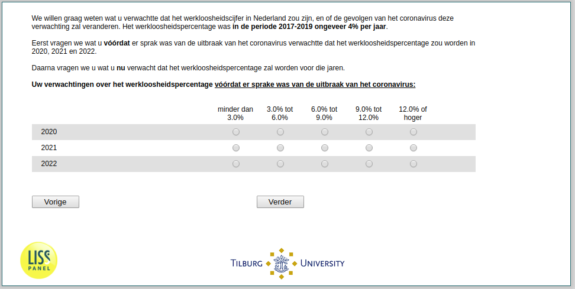

.. _w2e-ExpUnempl_before:

 
 .. role:: raw-html(raw) 
        :format: html 

`ExpUnempl_before` – Expected Unemployment Before
=============================================

We are also interested in your expectations of the rate of unemployment in the Netherlands, and how the impact of the corona virus has affected your expectations. Specifically, we would like to know what you think the unemployment rate would have been without the coronavirus pandemic and what it will likely be now with the pandemic.  The unemployment rate measures how many people out of 100 who would like to work do not have a job. On average, the unemployment rate was around 4% for the years 2017-2019. 

First, we would like to know the unemployment rates you expected for the years 2020, 2021, and 2022 before there was a sign of the coronavirus crisis. 

.. csv-table::
   :delim: |
   :header: ,less than 3.0%, 3.0% to 6.0%, 6.0% to 9.0%, 9.0% to 12.0%, 12.0% or higher

           2022 | :raw-html:`&#10063;`|:raw-html:`&#10063;`|:raw-html:`&#10063;`|:raw-html:`&#10063;`|:raw-html:`&#10063;`
           2021 | :raw-html:`&#10063;`|:raw-html:`&#10063;`|:raw-html:`&#10063;`|:raw-html:`&#10063;`|:raw-html:`&#10063;`
           2020 | :raw-html:`&#10063;`|:raw-html:`&#10063;`|:raw-html:`&#10063;`|:raw-html:`&#10063;`|:raw-html:`&#10063;`

:raw-html:`&larr;` :ref:`w2e-expectedincome` | :ref:`w2e-ExpUnempl_today` :raw-html:`&rarr;`
