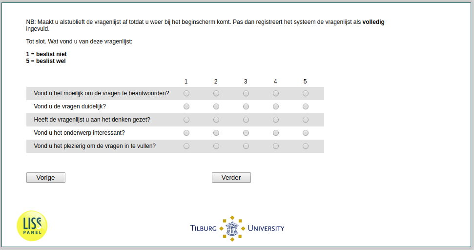

.. _w2e-eva2h: 

 
 .. role:: raw-html(raw) 
        :format: html 
 
`eva2h` – Liked Questionnaire
===================================== 

:raw-html:`&larr;` :ref:`w2e-q31` | :ref:`w2e-opm` :raw-html:`&rarr;` 
 

Note: Please complete the questionnaire until you are returned to the home screen. Only then will the system register the questionnaire as completed. Finally. What did you think of this questionnaire?
 
.. csv-table:: 
   :delim: | 
   :header: ,1 = definitely not, 2, 3, 4, 5 = certainly yes

 
           Did you find it difficult to answer the questions? | :raw-html:`&#10063;`|:raw-html:`&#10063;`|:raw-html:`&#10063;`|:raw-html:`&#10063;`|:raw-html:`&#10063;` 
           Were the questions clear to you? | :raw-html:`&#10063;`|:raw-html:`&#10063;`|:raw-html:`&#10063;`|:raw-html:`&#10063;`|:raw-html:`&#10063;` 
           Did the questionnaire get you thinking? | :raw-html:`&#10063;`|:raw-html:`&#10063;`|:raw-html:`&#10063;`|:raw-html:`&#10063;`|:raw-html:`&#10063;` 
           Did you find the subject interesting? | :raw-html:`&#10063;`|:raw-html:`&#10063;`|:raw-html:`&#10063;`|:raw-html:`&#10063;`|:raw-html:`&#10063;` 
           Did you enjoy answering the questions? | :raw-html:`&#10063;`|:raw-html:`&#10063;`|:raw-html:`&#10063;`|:raw-html:`&#10063;`|:raw-html:`&#10063;` 

:raw-html:`&larr;` :ref:`w2e-q31` | :ref:`w2e-opm` :raw-html:`&rarr;` 
 
