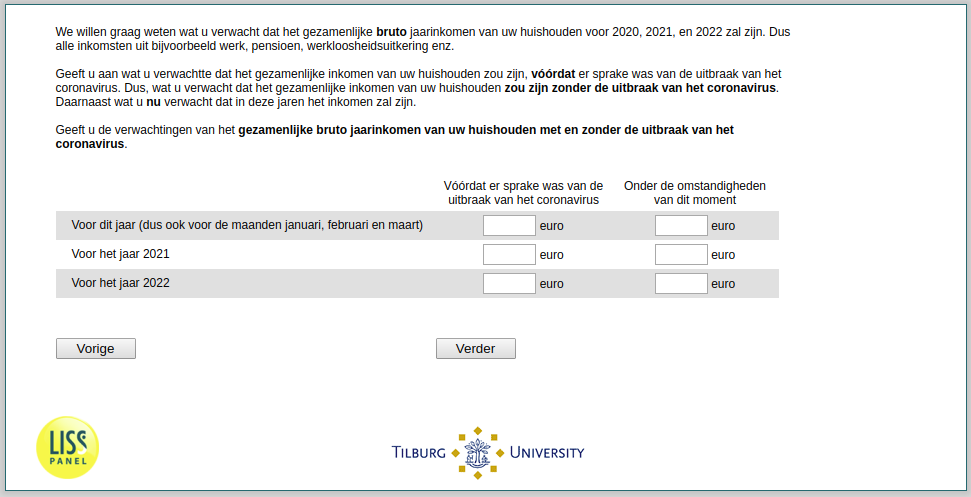

.. _w2e-expectedincome: 

 
 .. role:: raw-html(raw) 
        :format: html 
 
`expectedincome` – Expected Income Next Years
============================================================== 

:raw-html:`&larr;` :ref:`w2e-income` | :ref:`w2e-ExpUnempl_before` :raw-html:`&rarr;` 
 

Besides your monthly income in the last three months, we are also interested in your expectations of your household’s total annual gross income this year and in the next two years before taxes. By household’s total annual gross income  for the years 2020, 2021, and 2022 we mean all income such as earnings, business income, pensions, unemployment insurance payments, etc., that your household members may have before taxes in these years. 

We will ask you two times about your household’s expected total annual gross income for these years. First, we would like to know what level of income you expected before there was a sign of the coronavirus pandemic, that is what you thought your household’s expected total annual gross income would have been without the coronavirus pandemic. Second, we would like to know what level of total gross household income you expect for each of the three years as of today, taking the coronavirus pandemic into account.

Please state your expected total annual gross household income without and with the coronavirus crisis here.
 
.. csv-table:: 
   :delim: | 
   :header: ,Before there was a sign of the the coronavirus pandemic, Under the current circumstances
 
           For the year 2020 (which includes the months that already passed) | :raw-html:`<form><input type="text" id="fname" name="fname"> </form>` |:raw-html:`<form><input type="text" id="fname" name="fname"> </form>` 
           For the year 2021 | :raw-html:`<form><input type="text" id="fname" name="fname"> </form>` |:raw-html:`<form><input type="text" id="fname" name="fname"> </form>` 
           For the year 2022 | :raw-html:`<form><input type="text" id="fname" name="fname"> </form>` |:raw-html:`<form><input type="text" id="fname" name="fname"> </form>` 

:raw-html:`&larr;` :ref:`w2e-income` | :ref:`w2e-ExpUnempl_before` :raw-html:`&rarr;` 
 
