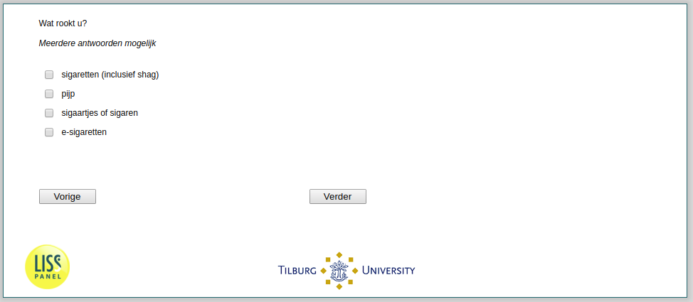

.. _w2e-he035: 

 
 .. role:: raw-html(raw) 
        :format: html 
 
`he035` – Smoking Type
============================== 

:raw-html:`&larr;` :ref:`w2e-rook` | :ref:`w2e-he036a` :raw-html:`&rarr;` 
 
*Routing to the question depends on answer in:* :ref:`w2e-rook` 

What do you smoke? Multiple answers possible
 
:raw-html:`&#10063;` – cigarettes (including rolling tobacco)
 
:raw-html:`&#10063;` – pipe
 
:raw-html:`&#10063;` – cigars or cigarillos
 
:raw-html:`&#10063;` – E-cigarettes
 

:raw-html:`&larr;` :ref:`w2e-rook` | :ref:`w2e-he036a` :raw-html:`&rarr;` 
 
