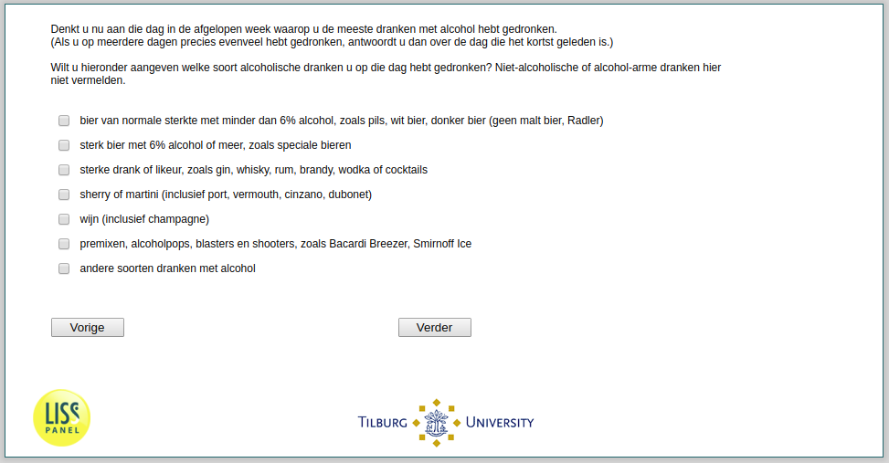

.. _w2e-he040:

 
 .. role:: raw-html(raw) 
        :format: html 

`he040` – Alcohol Type
======================

:raw-html:`&larr;` :ref:`w2e-he039` | :ref:`w2e-he040and` :raw-html:`&rarr;` 

*Routing to the question depends on answer in:* :ref:`w2e-he038`

Please think of the one day during the last week on which you drank the most amount of drinks containing alcohol. (If there are more days than one on which you drank exactly the same amount, answer the question with reference to the most recent day). Please indicate below what kind of alcoholic drink you drank that day. Do not mention any nonalcoholic or reduced alcoholic drinks).

:raw-html:`&#10063;` – beer of regular strength with less than 6% alcohol, such as pilsner, white
beer, dark beer (no malt beer, Radler)

:raw-html:`&#10063;` – strong beer with 6% alcohol or more, such as special beers

:raw-html:`&#10063;` – strong spirits or liquors, such as gin, whisky, rum, brandy, vodka or cocktails

:raw-html:`&#10063;` – sherry or martini (including port, vermouth, Cinzano, Dubonnet)

:raw-html:`&#10063;` – wine (including champagne)

:raw-html:`&#10063;` – premixes, alcohol pops, blasters and shooters, such as Bacardi Breezer,
Smirnoff Ice

:raw-html:`&#10063;` – other types of drinks containing alcohol

:raw-html:`&larr;` :ref:`w2e-he039` | :ref:`w2e-he040and` :raw-html:`&rarr;` 

