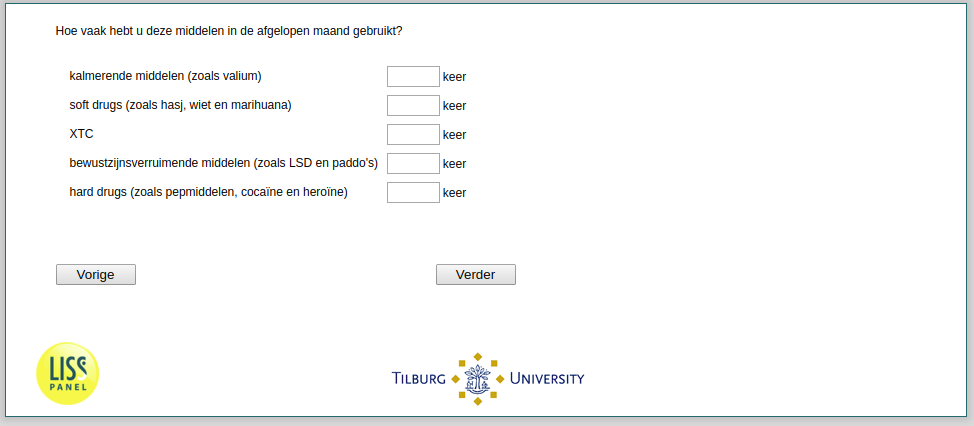

.. _w2e-he042: 

 
 .. role:: raw-html(raw) 
        :format: html 
 
`he042` – Drug Intake Last Month
======================================== 

:raw-html:`&larr;` :ref:`w2e-he041` | :ref:`w2e-loneliness` :raw-html:`&rarr;` 
 
*Routing to the question depends on answer in:* :ref:`w2e-he041` 

How often did you use these substances over the past month?
 
.. csv-table:: 
   :delim: | 
 
           sedatives (such as valium) | :raw-html:`<form><input type="text" id="fname" name="fname"> </form>` 
           soft drugs (such as hashish, marijuana) | :raw-html:`<form><input type="text" id="fname" name="fname"> </form>` 
           XTC | :raw-html:`<form><input type="text" id="fname" name="fname"> </form>` 
           hallucinogens (such as LSD, magic mushrooms) | :raw-html:`<form><input type="text" id="fname" name="fname"> </form>` 
           hard drugs (such as stimulants, cocaine, heroin) | :raw-html:`<form><input type="text" id="fname" name="fname"> </form>` 

:raw-html:`&larr;` :ref:`w2e-he041` | :ref:`w2e-loneliness` :raw-html:`&rarr;` 
 
