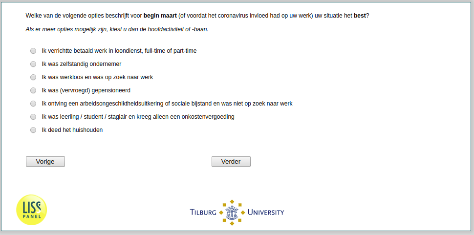

.. _w2e-q13: 

 
 .. role:: raw-html(raw) 
        :format: html 
 
`q13` – Work Status Beginning of March
============================================ 

:raw-html:`&larr;` :ref:`w2e-q23` | :ref:`w2e-q14` :raw-html:`&rarr;` 
 

Which of the following options describes your work situation at the beginning of March 2020 best?
 
.. csv-table:: 
   :delim: | 
   :header: employed, self-emplyed, unemployed, retired, social assistance, student or trainee, homemaker
 
           :raw-html:`&#10063;`|:raw-html:`&#10063;`|:raw-html:`&#10063;`|:raw-html:`&#10063;`|:raw-html:`&#10063;`|:raw-html:`&#10063;`|:raw-html:`&#10063;` 

:raw-html:`&larr;` :ref:`w2e-q23` | :ref:`w2e-q14` :raw-html:`&rarr;` 
 
