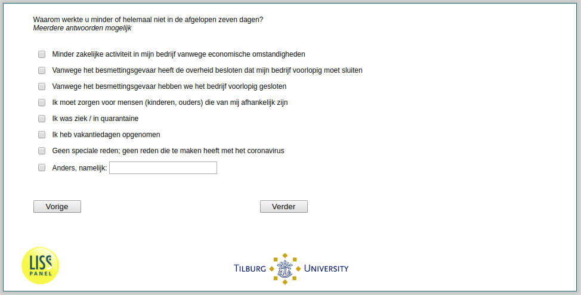

.. _w2e-q17:

 
 .. role:: raw-html(raw) 
        :format: html 

`q17` – Reasons for Working Not Or Less Among the Self-Employed
===============================================================

:raw-html:`&larr;` :ref:`w2e-q16` | :ref:`w2e-cruciaal` :raw-html:`&rarr;` 

*Routing to the question depends on answer in:* :ref:`w2e-q14header`

Why did you work are you not working less or not at all in the past seven daysthe moment? Multiple answers possible

:raw-html:`&#10063;` – Less business activity of my company because of economic conditions

:raw-html:`&#10063;` – Because of the risk of infection, the government shut down my company for the time being.

:raw-html:`&#10063;` – We closed the entire company for the time being due to the risk of contamination

:raw-html:`&#10063;` – I need to take care of people (children, parents) who depend on me

:raw-html:`&#10063;` – I have been sick / quarantined.

:raw-html:`&#10063;` – I took vacation days.

:raw-html:`&#10063;` – 
No special reason, no reason related to the corona virus

:raw-html:`&#10063;` – Otherwise, namely:

:raw-html:`&larr;` :ref:`w2e-q16` | :ref:`w2e-cruciaal` :raw-html:`&rarr;` 

