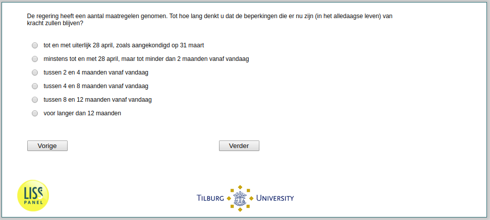

.. _w2e-q7: 

 
 .. role:: raw-html(raw) 
        :format: html 
 
`q7` – Expected Duration of Restrictions
============================================= 

:raw-html:`&larr;` :ref:`w2e-q1header` | :ref:`w2e-rook` :raw-html:`&rarr;` 
 

The government has adopted a number of measures … For how long do you think that the restrictions in place now (in everyday life) will remain in effect?
 
.. csv-table:: 
   :delim: | 
   :header: until April 28 at the latest, as announced on March 31, at least until April 28, but less than 2 months from today, between 2 and 4 months from today, between 4 and 8 months from today, between 8 and 12 months from today, for more than 12 months
 
           :raw-html:`&#10063;`|:raw-html:`&#10063;`|:raw-html:`&#10063;`|:raw-html:`&#10063;`|:raw-html:`&#10063;`|:raw-html:`&#10063;`|:raw-html:`&#10063;`|:raw-html:`&#10063;` 

:raw-html:`&larr;` :ref:`w2e-q1header` | :ref:`w2e-rook` :raw-html:`&rarr;` 
 
