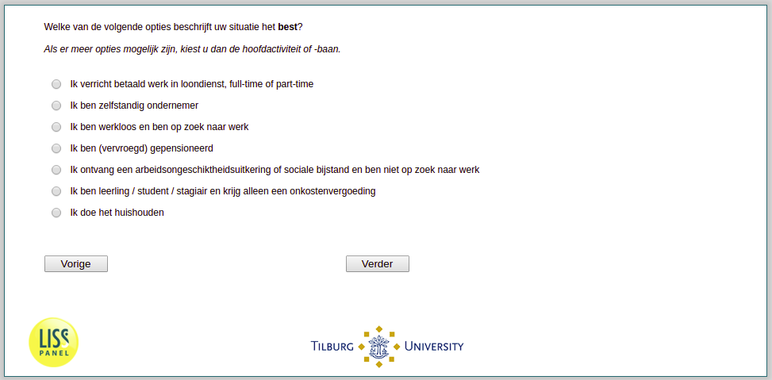

.. _w3d-EmploymentStatus: 

 
 .. role:: raw-html(raw) 
        :format: html 
 
`EmploymentStatus` – Work Status
=================================================== 

:raw-html:`&larr;` :ref:`w3d-expectedduration` | :ref:`w3d-q14` :raw-html:`&rarr;` 
 

Welke van de volgende opties beschrijft uw situatie het best? Als er meer opties mogelijk zijn, kiest u dan de hoofdactiviteit of -baan.
 
:raw-html:`&#10063;` – Ik verricht betaald werk in loondienst, full-time of part-time
 
:raw-html:`&#10063;` – Ik ben zelfstandig ondernemer
 
:raw-html:`&#10063;` – Ik ben werkloos en ben op zoek naar werk
 
:raw-html:`&#10063;` – Ik ben (vervroegd) gepensioneerd
 
:raw-html:`&#10063;` – Ik ontvang een arbeidsongeschiktheidsuitkering of sociale bijstand en ben niet op zoek naar werk
 
:raw-html:`&#10063;` – Ik ben leerling / student / stagiair en krijg alleen een onkostenvergoeding
 
:raw-html:`&#10063;` – Ik doe het huishouden
 

:raw-html:`&larr;` :ref:`w3d-expectedduration` | :ref:`w3d-q14` :raw-html:`&rarr;` 
 
