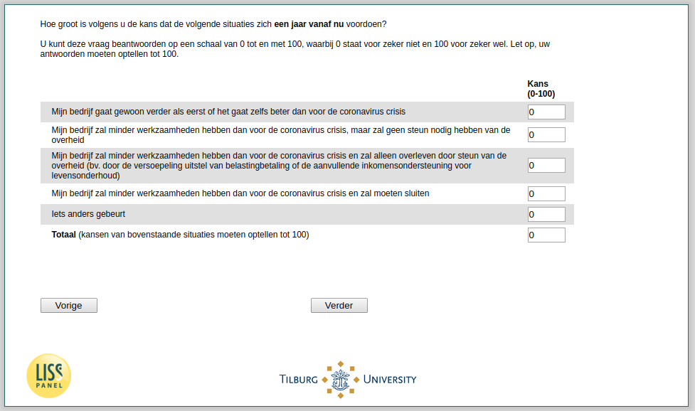

.. _w3d-Q27header_1: 

 
 .. role:: raw-html(raw) 
        :format: html 
 
`Q27header_1` – Expectations Next Year among Self-Employed
======================================================================== 

:raw-html:`&larr;` :ref:`w3d-q27header` | :ref:`w3d-q27header_unempl` :raw-html:`&rarr;` 
 
*Routing to the question depends on answer in:* :ref:`w3d-EmploymentStatus` 

Hoe groot is volgens u de kans dat de volgende situaties zich een jaar vanaf nu voordoen? U kunt deze vragen beantwoorden op een schaal van 0 tot en met 100, waarbij 0 staat voor zeker niet en 100 voor zeker wel. Let op, uw antwoorden moeten optellen tot 100.
 
.. csv-table:: 
   :delim: | 
 
           Mijn bedrijf gaat gewoon verder als eerst of het gaat zelfs beter dan voor de coronavirus crisis | :raw-html:`<form><input type="text" id="fname" name="fname"> </form>` 
           Mijn bedrijf zal minder werkzaamheden hebben dan voor de coronavirus crisis, maar zal geen steun nodig hebben van de overheid | :raw-html:`<form><input type="text" id="fname" name="fname"> </form>` 
           Mijn bedrijf zal minder werkzaamheden hebben dan voor de coronavirus crisis en zal alleen overleven door steun van de overheid (bv. door de versoepeling uitstel van belastingbetaling of de aanvullende inkomensondersteuning voor levensonderhoud) | :raw-html:`<form><input type="text" id="fname" name="fname"> </form>` 
           Mijn bedrijf zal minder werkzaamheden hebben dan voor de coronavirus crisis en zal moeten sluiten | :raw-html:`<form><input type="text" id="fname" name="fname"> </form>` 
           ets anders gebeurt | :raw-html:`<form><input type="text" id="fname" name="fname"> </form>` 
           nan | :raw-html:`<form><input type="text" id="fname" name="fname"> </form>` 

:raw-html:`&larr;` :ref:`w3d-q27header` | :ref:`w3d-q27header_unempl` :raw-html:`&rarr;` 
 
