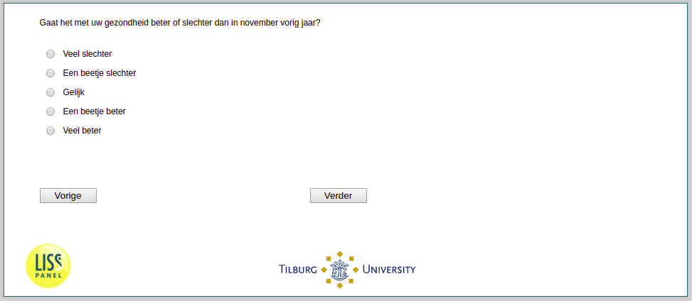

.. _w3d-SAH:

 
 .. role:: raw-html(raw) 
        :format: html 

`SAH` – Health
==============

:raw-html:`&larr;` :ref:`w3d-q30hd_maand` | :ref:`w3d-expectedduration` :raw-html:`&rarr;` 

Gaat het met uw gezondheid beter of slechter dan in november vorig jaar?

.. csv-table::
   :delim: |
   :header: Veel slechter, Een beetje slechter, Gelijk,Een beetje beter, Veel beter

           :raw-html:`&#10063;`|:raw-html:`&#10063;`|:raw-html:`&#10063;`|:raw-html:`&#10063;`|:raw-html:`&#10063;`

:raw-html:`&larr;` :ref:`w3d-q30hd_maand` | :ref:`w3d-expectedduration` :raw-html:`&rarr;` 

