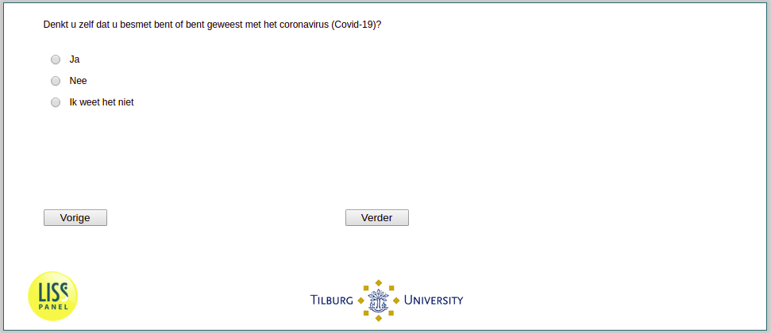

.. _w3d-SelfPerceivedInfection: 

 
 .. role:: raw-html(raw) 
        :format: html 
 
`SelfPerceivedInfection` – SelfPerceivedInfection
========================================================================== 

:raw-html:`&larr;` :ref:`w3d-InfectionDiagnosed` | :ref:`w3d-q1header` :raw-html:`&rarr;` 
 

Denkt u zelf dat u besmet bent met het coronavirus (Covid-19)?
 
.. csv-table:: 
   :delim: | 
   :header: Ja, Nee, Ik weet het niet
 
           :raw-html:`&#10063;`|:raw-html:`&#10063;`|:raw-html:`&#10063;` 

:raw-html:`&larr;` :ref:`w3d-InfectionDiagnosed` | :ref:`w3d-q1header` :raw-html:`&rarr;` 
 
