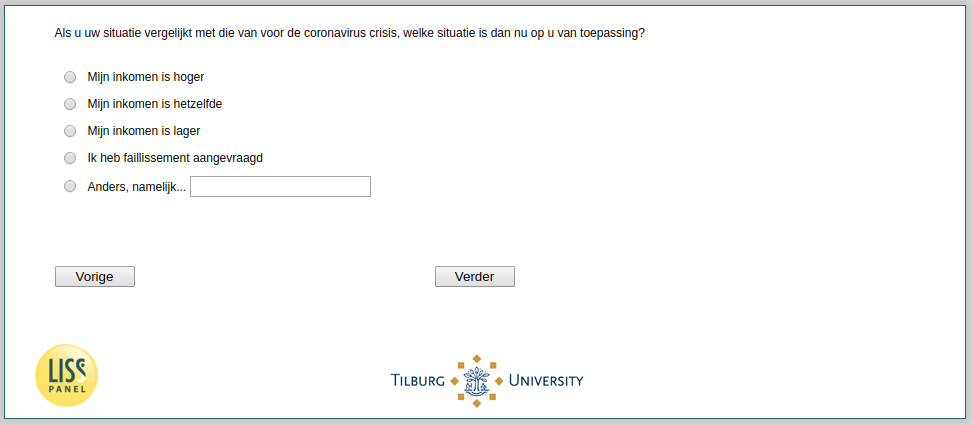

.. _w3d-change_selfempl:

 
 .. role:: raw-html(raw) 
        :format: html 

`change_selfempl` – Self-Employed Changes
=========================================

:raw-html:`&larr;` :ref:`w3d-change_empl` | :ref:`w3d-q2` :raw-html:`&rarr;` 

*Routing to the question depends on answer in:* :ref:`w3d-EmploymentStatus`

Als u uw situatie vergelijkt met die van voor de coronavirus crisis, welke situatie is dan nu op u van toepassing?

:raw-html:`&#10063;` – Mijn inkomen is hoger

:raw-html:`&#10063;` – Mijn inkomen is hetzelfde

:raw-html:`&#10063;` – Mijn inkomen is lager

:raw-html:`&#10063;` – Ik heb faillissement aangevraagd

:raw-html:`&#10063;` – Anders, namelijk...

:raw-html:`&larr;` :ref:`w3d-change_empl` | :ref:`w3d-q2` :raw-html:`&rarr;` 

