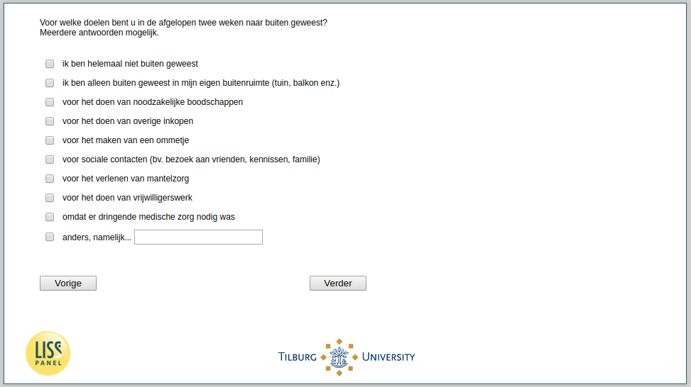

.. _w3d-es4_doelen:

 
 .. role:: raw-html(raw) 
        :format: html 

`es4_doelen` – Reasons for Going Outside
========================================

:raw-html:`&larr;` :ref:`w3d-es4_uitspraken` | :ref:`w3d-q28` :raw-html:`&rarr;` 

*Routing to the question depends on answer in:* :ref:`w3d-nan`

Voor welke doelen bent u in de afgelopen twee weken naar buiten geweest?Meerdere antwoorden mogelijk.

:raw-html:`&#10063;` – ik ben helemaal niet buiten geweest

:raw-html:`&#10063;` – ik ben alleen buiten geweest in mijn eigen buitenruimte (tuin, balkon enz.)

:raw-html:`&#10063;` – voor het doen van noodzakelijke boodschappen

:raw-html:`&#10063;` – voor het doen van overige inkopen

:raw-html:`&#10063;` – voor het maken van een ommetje

:raw-html:`&#10063;` – voor sociale contacten (bv. bezoek aan vrienden, kennissen, familie)

:raw-html:`&#10063;` – voor het verlenen van mantelzorg

:raw-html:`&#10063;` – voor het doen van vrijwilligerswerk

:raw-html:`&#10063;` – omdat er dringende medische zorg nodig was

:raw-html:`&#10063;` – anders, namelijk...

:raw-html:`&larr;` :ref:`w3d-es4_uitspraken` | :ref:`w3d-q28` :raw-html:`&rarr;` 

