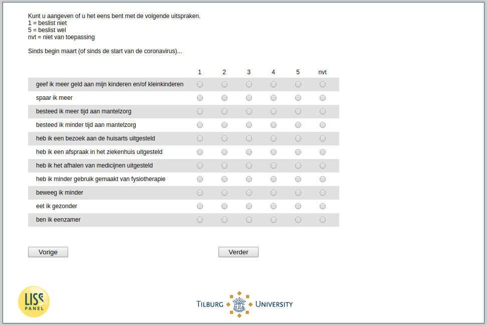

.. _w3d-es4_uitspraken:

 
 .. role:: raw-html(raw) 
        :format: html 

`es4_uitspraken` – Activities since March
=========================================

:raw-html:`&larr;` :ref:`w3d-korting` | :ref:`w3d-es4_doelen` :raw-html:`&rarr;` 

*Routing to the question depends on answer in:* :ref:`w3d-nan`

Kunt u aangeven of u het eens bent met de volgende uitspraken. 1 = beslist niet 5 = beslist wel nvt = niet van toepassing Sinds begin maart (of sinds de start van de coronavirus)…

.. csv-table::
   :delim: |
   :header: ,1,2,3,4,5,nvt

           geef ik meer geld aan mijn kinderen en/of kleinkinderen | :raw-html:`&#10063;`|:raw-html:`&#10063;`|:raw-html:`&#10063;`|:raw-html:`&#10063;`|:raw-html:`&#10063;`|:raw-html:`&#10063;`
           spaar ik meer | :raw-html:`&#10063;`|:raw-html:`&#10063;`|:raw-html:`&#10063;`|:raw-html:`&#10063;`|:raw-html:`&#10063;`|:raw-html:`&#10063;`
           besteed ik meer tijd aan mantelzorg | :raw-html:`&#10063;`|:raw-html:`&#10063;`|:raw-html:`&#10063;`|:raw-html:`&#10063;`|:raw-html:`&#10063;`|:raw-html:`&#10063;`
           besteed ik minder tijd aan mantelzorg | :raw-html:`&#10063;`|:raw-html:`&#10063;`|:raw-html:`&#10063;`|:raw-html:`&#10063;`|:raw-html:`&#10063;`|:raw-html:`&#10063;`
           heb ik een bezoek aan de huisarts uitgesteld | :raw-html:`&#10063;`|:raw-html:`&#10063;`|:raw-html:`&#10063;`|:raw-html:`&#10063;`|:raw-html:`&#10063;`|:raw-html:`&#10063;`
           heb ik een afspraak in het ziekenhuis uitgesteld | :raw-html:`&#10063;`|:raw-html:`&#10063;`|:raw-html:`&#10063;`|:raw-html:`&#10063;`|:raw-html:`&#10063;`|:raw-html:`&#10063;`
           heb ik het afhalen van medicijnen uitgesteld | :raw-html:`&#10063;`|:raw-html:`&#10063;`|:raw-html:`&#10063;`|:raw-html:`&#10063;`|:raw-html:`&#10063;`|:raw-html:`&#10063;`
           heb ik minder gebruik gemaakt van fysiotherapie | :raw-html:`&#10063;`|:raw-html:`&#10063;`|:raw-html:`&#10063;`|:raw-html:`&#10063;`|:raw-html:`&#10063;`|:raw-html:`&#10063;`
           beweeg ik minder | :raw-html:`&#10063;`|:raw-html:`&#10063;`|:raw-html:`&#10063;`|:raw-html:`&#10063;`|:raw-html:`&#10063;`|:raw-html:`&#10063;`
           eet ik gezonder | :raw-html:`&#10063;`|:raw-html:`&#10063;`|:raw-html:`&#10063;`|:raw-html:`&#10063;`|:raw-html:`&#10063;`|:raw-html:`&#10063;`
           ben ik eenzamer | :raw-html:`&#10063;`|:raw-html:`&#10063;`|:raw-html:`&#10063;`|:raw-html:`&#10063;`|:raw-html:`&#10063;`|:raw-html:`&#10063;`

:raw-html:`&larr;` :ref:`w3d-korting` | :ref:`w3d-es4_doelen` :raw-html:`&rarr;` 

