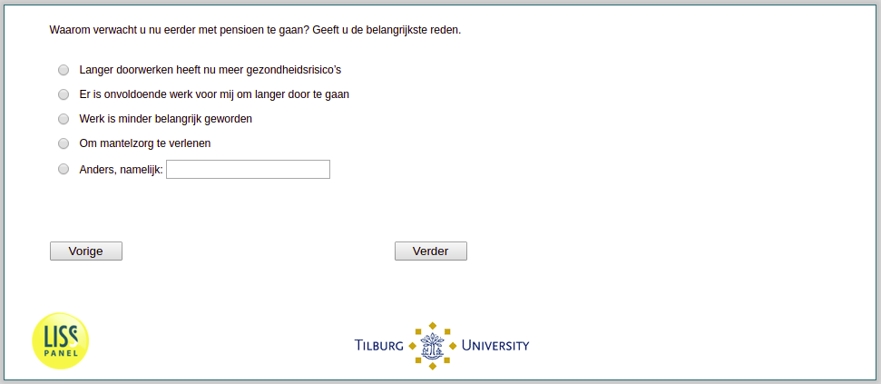

.. _w3d-pens_eerder:

 
 .. role:: raw-html(raw) 
        :format: html 

`pens_eerder` – Reasons for Early Retirement
============================================

:raw-html:`&larr;` :ref:`w3d-exp_pens_hd` | :ref:`w3d-pens_later` :raw-html:`&rarr;` 

*Routing to the question depends on answer in:* :ref:`w3d-nan`

Waarom verwacht u nu eerder met pensioen te gaan? Geeft u de belangrijkste reden.

:raw-html:`&#10063;` – Langer doorwerken heeft nu meer gezondheidsrisico’s

:raw-html:`&#10063;` – Er is onvoldoende werk voor mij om langer door te gaan

:raw-html:`&#10063;` – Werk is minder belangrijk geworden

:raw-html:`&#10063;` – Om mantelzorg te verlenen

:raw-html:`&#10063;` – Anders, namelijk:

:raw-html:`&larr;` :ref:`w3d-exp_pens_hd` | :ref:`w3d-pens_later` :raw-html:`&rarr;` 

