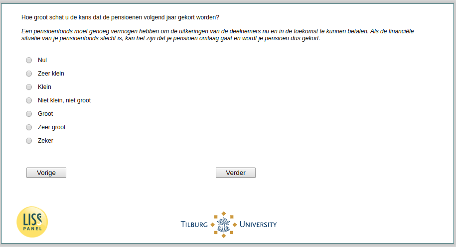

.. _w3d-pens_gekort: 

 
 .. role:: raw-html(raw) 
        :format: html 
 
`pens_gekort` – Expected Pension Cuts
=================================================== 

:raw-html:`&larr;` :ref:`w3d-q27header_unempl` | :ref:`w3d-korting` :raw-html:`&rarr;` 
 
*Routing to the question depends on answer in:* :ref:`w3d-EmploymentStatus` 

Hoe groot schat u de kans dat de pensioenen volgend jaar gekort worden? Een pensioenfonds moet genoeg vermogen hebben om de uitkeringen van de deelnemers nu en in de toekomst te kunnen betalen. Als de financiële situatie van je pensioenfonds slecht is, kan het zijn dat je pensioen omlaag gaat en wordt je pensioen dus gekort. 
 
.. csv-table:: 
   :delim: | 
   :header: Nul, Zeer klein ,Klein, Niet klein, niet groot, Groot, Zeer groot, Zeker
 
           :raw-html:`&#10063;`|:raw-html:`&#10063;`|:raw-html:`&#10063;`|:raw-html:`&#10063;`|:raw-html:`&#10063;`|:raw-html:`&#10063;`|:raw-html:`&#10063;`|:raw-html:`&#10063;` 

:raw-html:`&larr;` :ref:`w3d-q27header_unempl` | :ref:`w3d-korting` :raw-html:`&rarr;` 
 
