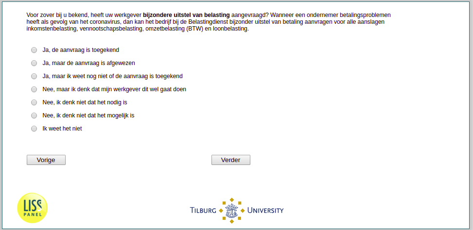

.. _w3d-q16c: 

 
 .. role:: raw-html(raw) 
        :format: html 
 
`q16c` – Tax Deferral
============================ 

:raw-html:`&larr;` :ref:`w3d-q16b` | :ref:`w3d-q17a` :raw-html:`&rarr;` 
 
*Routing to the question depends on answer in:* :ref:`w3d-EmploymentStatus` 

Voor zover bij u bekend, heeft uw werkgever bijzondere uitstel van belasting aangevraagd? Wanneer een ondernemer betalingsproblemen heeft als gevolg van het coronavirus, dan kan het bedrijf bij de Belastingdienst bijzonder uitstel van betaling aanvragen voor alle aanslagen inkomstenbelasting, vennootschapsbelasting, omzetbelasting (BTW) en loonbelasting.
 
:raw-html:`&#10063;` – Ja, de aanvraag is toegekend
 
:raw-html:`&#10063;` – Ja, maar de aanvraag is afgewezen
 
:raw-html:`&#10063;` – Ja, maar ik weet nog niet of de aanvraag is toegekend
 
:raw-html:`&#10063;` – Nee, maar ik denk dat mijn werkgever dit wel gaat doen
 
:raw-html:`&#10063;` – Nee, ik denk niet dat het nodig is
 
:raw-html:`&#10063;` – Nee, ik denk niet dat het mogelijk is
 
:raw-html:`&#10063;` – Ik weet het niet
 

:raw-html:`&larr;` :ref:`w3d-q16b` | :ref:`w3d-q17a` :raw-html:`&rarr;` 
 
