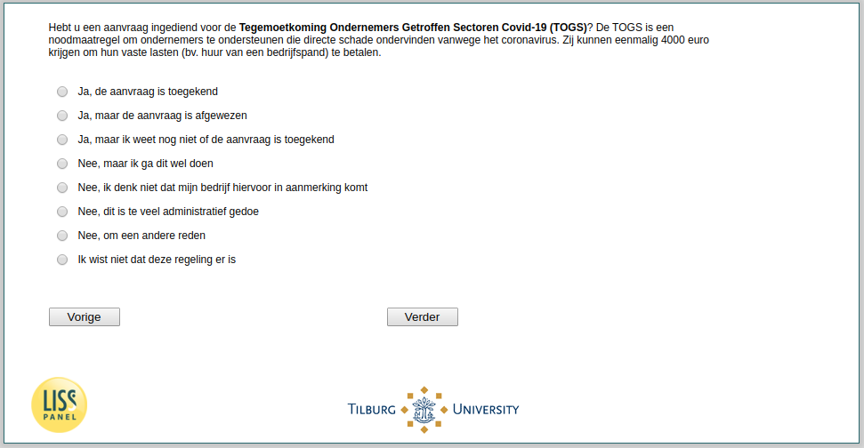

.. _w3d-q17b:

 
 .. role:: raw-html(raw) 
        :format: html 

`q17b` – TOGS among Self-Employed
=================================

:raw-html:`&larr;` :ref:`w3d-q17a` | :ref:`w3d-q17c` :raw-html:`&rarr;` 

*Routing to the question depends on answer in:* :ref:`w3d-nan`

Hebt u een aanvraag ingediend voor de Tegemoetkoming Ondernemers Getroffen Sectoren Covid-19 (TOGS)? De TOGS is een noodmaatregel om ondernemers te ondersteunen die directe schade ondervinden vanwege het coronavirus. Zij kunnen eenmalig 4000 euro krijgen om hun vaste lasten (bv. huur van een bedrijfspand) te betalen.

:raw-html:`&#10063;` – Ja, de aanvraag is toegekend

:raw-html:`&#10063;` – Ja, maar de aanvraag is afgewezen

:raw-html:`&#10063;` – Ja, maar ik weet nog niet of de aanvraag is toegekend

:raw-html:`&#10063;` – Nee, maar ik ga dit wel doen

:raw-html:`&#10063;` – Nee, ik denk niet dat mijn bedrijf hiervoor in aanmerking komt

:raw-html:`&#10063;` – Nee, dit is te veel administratief gedoe

:raw-html:`&#10063;` – Nee, om een andere reden

:raw-html:`&#10063;` – Ik wist niet dat deze regeling er is

:raw-html:`&larr;` :ref:`w3d-q17a` | :ref:`w3d-q17c` :raw-html:`&rarr;` 

