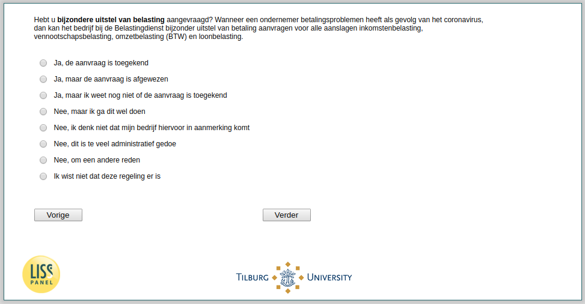

.. _w3d-q17c: 

 
 .. role:: raw-html(raw) 
        :format: html 
 
`q17c` – Tax Deferral among Self-Employed
================================================ 

:raw-html:`&larr;` :ref:`w3d-q17b` | :ref:`w3d-q17d` :raw-html:`&rarr;` 
 
*Routing to the question depends on answer in:* :ref:`w3d-EmploymentStatus` 

Hebt u bijzondere uitstel van belasting aangevraagd? Wanneer een ondernemer betalingsproblemen heeft als gevolg van het coronavirus, dan kan het bedrijf bij de Belastingdienst bijzonder uitstel van betaling aanvragen voor alle aanslagen inkomstenbelasting, vennootschapsbelasting, omzetbelasting (BTW) en loonbelasting.
 
:raw-html:`&#10063;` – Ja, de aanvraag is toegekend
 
:raw-html:`&#10063;` – Ja, maar de aanvraag is afgewezen
 
:raw-html:`&#10063;` – Ja, maar ik weet nog niet of de aanvraag is toegekend
 
:raw-html:`&#10063;` – Nee, maar ik ga dit wel doen
 
:raw-html:`&#10063;` – Nee, ik denk niet dat mijn bedrijf hiervoor in aanmerking komt
 
:raw-html:`&#10063;` – Nee, dit is te veel administratief gedoe
 
:raw-html:`&#10063;` – Nee, om een andere reden
 
:raw-html:`&#10063;` – Ik wist niet dat deze regeling er is
 

:raw-html:`&larr;` :ref:`w3d-q17b` | :ref:`w3d-q17d` :raw-html:`&rarr;` 
 
