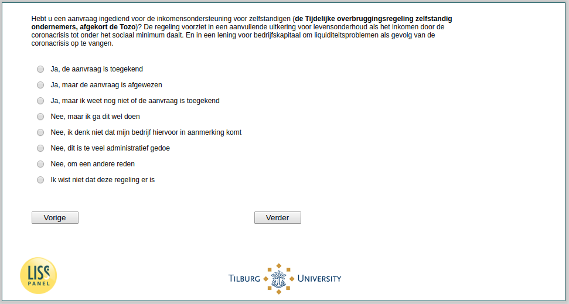

.. _w3d-q17d:

 
 .. role:: raw-html(raw) 
        :format: html 

`q17d` – Tozo among Self-Employed
=================================

:raw-html:`&larr;` :ref:`w3d-q17c` | :ref:`w3d-q17e` :raw-html:`&rarr;` 

*Routing to the question depends on answer in:* :ref:`w3d-EmploymentStatus`

Hebt u een aanvraag ingediend voor de inkomensondersteuning voor zelfstandigen (de Tijdelijke overbruggingsregeling zelfstandig ondernemers, afgekort de Tozo)? De regeling voorziet in een aanvullende uitkering voor levensonderhoud als het inkomen door de coronacrisis tot onder het sociaal minimum daalt. En in een lening voor bedrijfskapitaal om liquiditeitsproblemen als gevolg van de coronacrisis op te vangen.

:raw-html:`&#10063;` – Ja, de aanvraag is toegekend

:raw-html:`&#10063;` – Ja, maar de aanvraag is afgewezen

:raw-html:`&#10063;` – Ja, maar ik weet nog niet of de aanvraag is toegekend

:raw-html:`&#10063;` – Nee, maar ik ga dit wel doen

:raw-html:`&#10063;` – Nee, ik denk niet dat mijn bedrijf hiervoor in aanmerking komt

:raw-html:`&#10063;` – Nee, dit is te veel administratief gedoe

:raw-html:`&#10063;` – Nee, om een andere reden

:raw-html:`&#10063;` – Ik wist niet dat deze regeling er is

:raw-html:`&larr;` :ref:`w3d-q17c` | :ref:`w3d-q17e` :raw-html:`&rarr;` 

