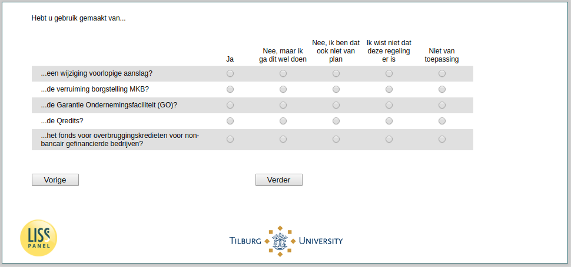

.. _w3d-q17f_header: 

 
 .. role:: raw-html(raw) 
        :format: html 
 
`q17f_header` – Other support Self-Employed
========================================================= 

:raw-html:`&larr;` :ref:`w3d-q17e` | :ref:`w3d-change_empl` :raw-html:`&rarr;` 
 
*Routing to the question depends on answer in:* :ref:`w3d-EmploymentStatus` 

Hebt u gebruik gemaakt van...
 
.. csv-table:: 
   :delim: | 
   :header: ,Ja, Nee maar ik ga, dit wel doen, Nee ik, ben dat ook niet van, plan, Ik wist niet dat deze, regeling er is, Niet van toepassing
 
           ...een wijziging voorlopige aanslag? | :raw-html:`&#10063;`|:raw-html:`&#10063;`|:raw-html:`&#10063;`|:raw-html:`&#10063;`|:raw-html:`&#10063;`|:raw-html:`&#10063;`|:raw-html:`&#10063;`|:raw-html:`&#10063;`|:raw-html:`&#10063;` 
           ...de verruiming borgstelling MKB? | :raw-html:`&#10063;`|:raw-html:`&#10063;`|:raw-html:`&#10063;`|:raw-html:`&#10063;`|:raw-html:`&#10063;`|:raw-html:`&#10063;`|:raw-html:`&#10063;`|:raw-html:`&#10063;`|:raw-html:`&#10063;` 
           ...de Garantie Ondernemingsfaciliteit (GO)? | :raw-html:`&#10063;`|:raw-html:`&#10063;`|:raw-html:`&#10063;`|:raw-html:`&#10063;`|:raw-html:`&#10063;`|:raw-html:`&#10063;`|:raw-html:`&#10063;`|:raw-html:`&#10063;`|:raw-html:`&#10063;` 
           ...de Qredits? | :raw-html:`&#10063;`|:raw-html:`&#10063;`|:raw-html:`&#10063;`|:raw-html:`&#10063;`|:raw-html:`&#10063;`|:raw-html:`&#10063;`|:raw-html:`&#10063;`|:raw-html:`&#10063;`|:raw-html:`&#10063;` 
           ...het fonds voor overbruggingskredieten voor non-bancair gefinancierde bedrijven? | :raw-html:`&#10063;`|:raw-html:`&#10063;`|:raw-html:`&#10063;`|:raw-html:`&#10063;`|:raw-html:`&#10063;`|:raw-html:`&#10063;`|:raw-html:`&#10063;`|:raw-html:`&#10063;`|:raw-html:`&#10063;` 

:raw-html:`&larr;` :ref:`w3d-q17e` | :ref:`w3d-change_empl` :raw-html:`&rarr;` 
 
