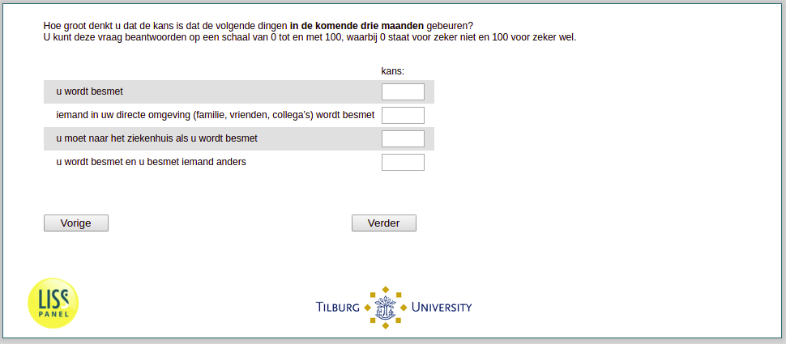

.. _w3d-q1header: 

 
 .. role:: raw-html(raw) 
        :format: html 
 
`q1header` – Subjective Risks
======================================== 

:raw-html:`&larr;` :ref:`w3d-SelfPerceivedInfection` | :ref:`w3d-q30` :raw-html:`&rarr;` 
 

Hoe groot denkt u dat de kans is dat de volgende dingen in de komende drie maanden gebeuren?  U kunt deze vraag beantwoorden op een schaal van 0 tot en met 100, waarbij 0 staat voor zeker niet en 100 voor zeker wel.
 
.. csv-table:: 
   :delim: | 
 
           u wordt besmet | :raw-html:`<form><input type="text" id="fname" name="fname"> </form>` 
           iemand in uw directe omgeving (familie, vrienden, collega’s) wordt besmet | :raw-html:`<form><input type="text" id="fname" name="fname"> </form>` 
           u moet naar het ziekenhuis als u wordt besmet | :raw-html:`<form><input type="text" id="fname" name="fname"> </form>` 
           u wordt besmet en u besmet iemand anders | :raw-html:`<form><input type="text" id="fname" name="fname"> </form>` 

:raw-html:`&larr;` :ref:`w3d-SelfPerceivedInfection` | :ref:`w3d-q30` :raw-html:`&rarr;` 
 
