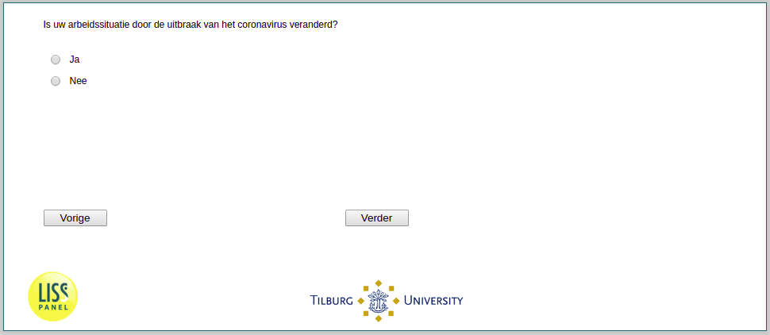

.. _w3d-q2: 

 
 .. role:: raw-html(raw) 
        :format: html 
 
`q2` – Work Change
======================= 

:raw-html:`&larr;` :ref:`w3d-change_selfempl` | :ref:`w3d-q4_header` :raw-html:`&rarr;` 
 
*Routing to the question depends on answer in:* :ref:`w3d-EmploymentStatus` 

^f_q2; Is uw arbeidssituatie door de uitbraak van het coronavirus veranderd?
 
.. csv-table:: 
   :delim: | 
   :header: Ja, Nee
 
           :raw-html:`&#10063;`|:raw-html:`&#10063;` 

:raw-html:`&larr;` :ref:`w3d-change_selfempl` | :ref:`w3d-q4_header` :raw-html:`&rarr;` 
 
