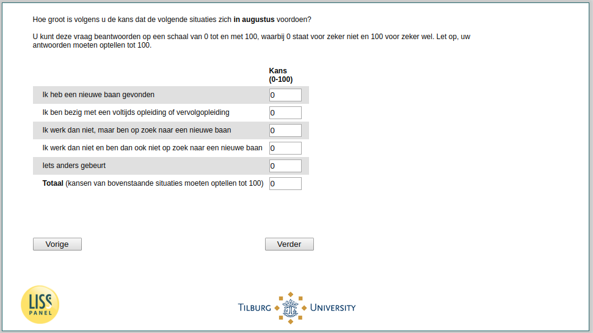

.. _w3d-q27header_unempl:

 
 .. role:: raw-html(raw) 
        :format: html 

`q27header_unempl` – Expectations August among Unemployed
=========================================================

:raw-html:`&larr;` :ref:`w3d-Q27header_1` | :ref:`w3d-pens_gekort` :raw-html:`&rarr;` 

*Routing to the question depends on answer in:* :ref:`w3d-EmploymentStatus`

Hoe groot is volgens u de kans dat de volgende situaties zich in augustus voordoen? U kunt deze vraag beantwoorden op een schaal van 0 tot en met 100, waarbij 0 staat voor zeker niet en 100 voor zeker wel. Let op, uw antwoorden moeten optellen tot 100.

.. csv-table::
   :delim: |

           Ik heb een nieuwe baan gevonden | :raw-html:`<form><input type="text" id="fname" name="fname"> </form>`
           Ik ben bezig met een voltijds opleiding of vervolgopleiding | :raw-html:`<form><input type="text" id="fname" name="fname"> </form>`
           Ik werk dan niet, maar ben op zoek naar een nieuwe baan | :raw-html:`<form><input type="text" id="fname" name="fname"> </form>`
           Ik werk dan niet en ben dan ook niet op zoek naar een nieuwe baan | :raw-html:`<form><input type="text" id="fname" name="fname"> </form>`
           Iets anders gebeurt | :raw-html:`<form><input type="text" id="fname" name="fname"> </form>`
           nan | :raw-html:`<form><input type="text" id="fname" name="fname"> </form>`

:raw-html:`&larr;` :ref:`w3d-Q27header_1` | :ref:`w3d-pens_gekort` :raw-html:`&rarr;` 

