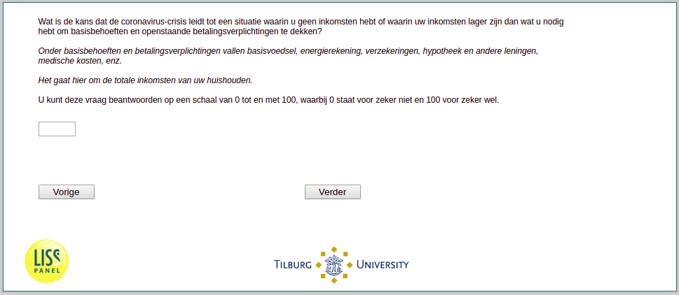

.. _w3d-q28:

 
 .. role:: raw-html(raw) 
        :format: html 

`q28` – Probability of Period With Low Income
=============================================

:raw-html:`←` :ref:`w3d-es4_doelen` | :ref:`w3d-q29` :raw-html:`→` 

*Routing to the question depends on answer in:* :ref:`w3d-nan`

Wat is de kans dat de coronavirus-crisis leidt tot een situatie waarin u geen inkomsten hebt of waarin uw inkomsten lager zijn dan wat u nodig hebt om basisbehoeften en openstaande betalingsverplichtingen te dekken? Onder basisbehoeften en betalingsverplichtingen vallen basisvoedsel, energierekening, verzekeringen, hypotheek en andere leningen, medische kosten, enz.Het gaat hier om de totale inkomsten van uw huishouden. U kunt deze vraag beantwoorden op een schaal van 0 tot en met 100, waarbij 0 staat voor zeker niet en 100 voor zeker wel. 

:raw-html:`←` :ref:`w3d-es4_doelen` | :ref:`w3d-q29` :raw-html:`→` 

