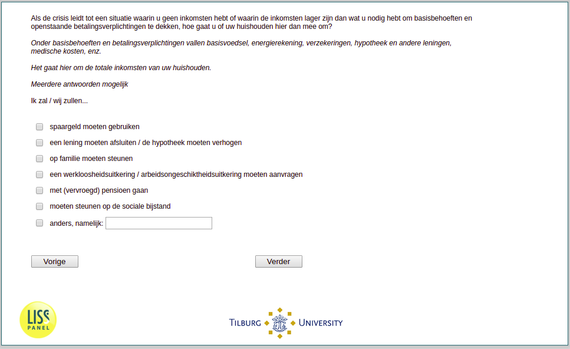

.. _w3d-q29:

 
 .. role:: raw-html(raw) 
        :format: html 

`q29` – Economic Coping Strategies
==================================

:raw-html:`&larr;` :ref:`w3d-q28` | :ref:`w3d-q31header` :raw-html:`&rarr;` 

Als de crisis leidt tot een situatie waarin u geen inkomsten hebt of waarin de inkomsten lager zijn dan wat u nodig hebt om basisbehoeften en openstaande betalingsverplichtingen te dekken, hoe gaat u of uw huishouden hier dan mee om. Onder basisbehoeften en betalingsverplichtingen vallen basisvoedsel, energierekening, verzekeringen, hypotheek en andere leningen, medische kosten, enz. Het gaat hier om de totale inkomsten van uw huishouden. Meerdere antwoorden mogelijk Ik zal / wij zullen…

:raw-html:`&#10063;` – spaargeld moeten gebruiken

:raw-html:`&#10063;` – een lening moeten afsluiten / de hypotheek moeten verhogen

:raw-html:`&#10063;` – op familie moeten steunen

:raw-html:`&#10063;` – een werkloosheidsuitkering / arbeidsongeschiktheidsuitkering moeten aanvragen

:raw-html:`&#10063;` – met (vervroegd) pensioen gaan

:raw-html:`&#10063;` – moeten steunen op de sociale bijstand

:raw-html:`&#10063;` – anders, namelijk:

:raw-html:`&larr;` :ref:`w3d-q28` | :ref:`w3d-q31header` :raw-html:`&rarr;` 

