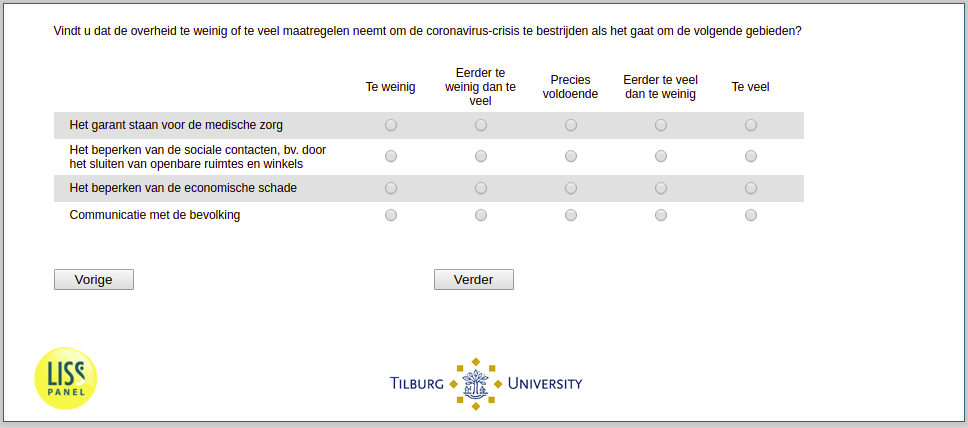

.. _w3d-q33: 

 
 .. role:: raw-html(raw) 
        :format: html 
 
`q33` – Government Action
=============================== 

:raw-html:`&larr;` :ref:`w3d-q31` | :ref:`w3d-v0` :raw-html:`&rarr;` 
 

Vindt u dat de overheid te weinig of te veel maatregelen neemt om de coronavirus-crisis te bestrijden als het gaat om de volgende gebieden?
 
.. csv-table:: 
   :delim: | 
   :header: ,Te weinig, Eerder te weinig dan te veel, Precies voldoende, Eerder te veel dan te weinig, Te veel
 
           Het garant staan voor de medische zorg | :raw-html:`&#10063;`|:raw-html:`&#10063;`|:raw-html:`&#10063;`|:raw-html:`&#10063;`|:raw-html:`&#10063;` 
           Het beperken van de sociale contacten, bv. door het sluiten van openbare ruimtes en winkels | :raw-html:`&#10063;`|:raw-html:`&#10063;`|:raw-html:`&#10063;`|:raw-html:`&#10063;`|:raw-html:`&#10063;` 
           Het beperken van de economische schade | :raw-html:`&#10063;`|:raw-html:`&#10063;`|:raw-html:`&#10063;`|:raw-html:`&#10063;`|:raw-html:`&#10063;` 
           Communicatie met de bevolking | :raw-html:`&#10063;`|:raw-html:`&#10063;`|:raw-html:`&#10063;`|:raw-html:`&#10063;`|:raw-html:`&#10063;` 

:raw-html:`&larr;` :ref:`w3d-q31` | :ref:`w3d-v0` :raw-html:`&rarr;` 
 
