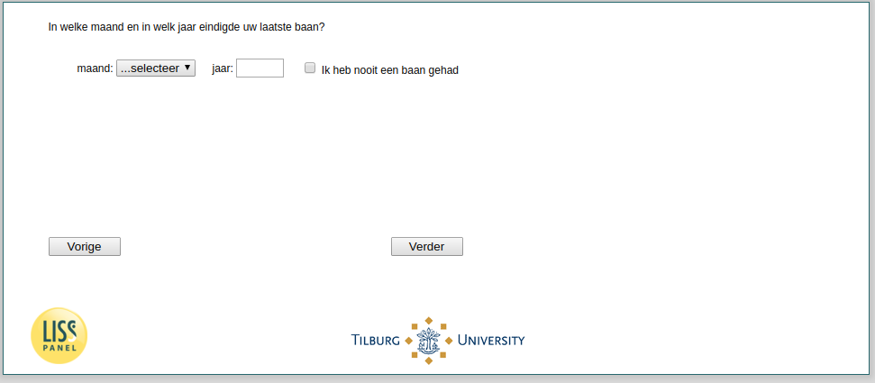

.. _w3d-q4_header:

 
 .. role:: raw-html(raw) 
        :format: html 

`q4_header` – Last Job End
==========================

:raw-html:`&larr;` :ref:`w3d-q2` | :ref:`w3d-distance` :raw-html:`&rarr;` 

*Routing to the question depends on answer in:* :ref:`w3d-EmploymentStatus`

In welke maand en in welk jaar eindigde uw laatste baan?

.. csv-table::
   :delim: |

           jaar | :raw-html:`<form><input type="text" id="fname" name="fname"> </form>`
           maand | :raw-html:`<form><input type="text" id="fname" name="fname"> </form>`

:raw-html:`&larr;` :ref:`w3d-q2` | :ref:`w3d-distance` :raw-html:`&rarr;` 

