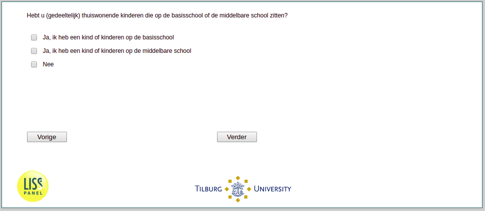

.. _w3d-v0:

 
 .. role:: raw-html(raw) 
        :format: html 

`v0` – School Aged Children in Household
========================================

:raw-html:`←` :ref:`w3d-q33header` | :ref:`w3d-v0a` :raw-html:`→` 

Hebt u (gedeeltelijk) thuiswonende kinderen die op de basisschool of de middelbare school zitten?

.. csv-table::
   :delim: |
   :header: Ja ik heb een kind of kinderen op de basisschool, Ja ik heb een kind of kinderen op de middelbare school, Nee

           :raw-html:`❏`|:raw-html:`❏`|:raw-html:`❏`

:raw-html:`←` :ref:`w3d-q33header` | :ref:`w3d-v0a` :raw-html:`→` 

