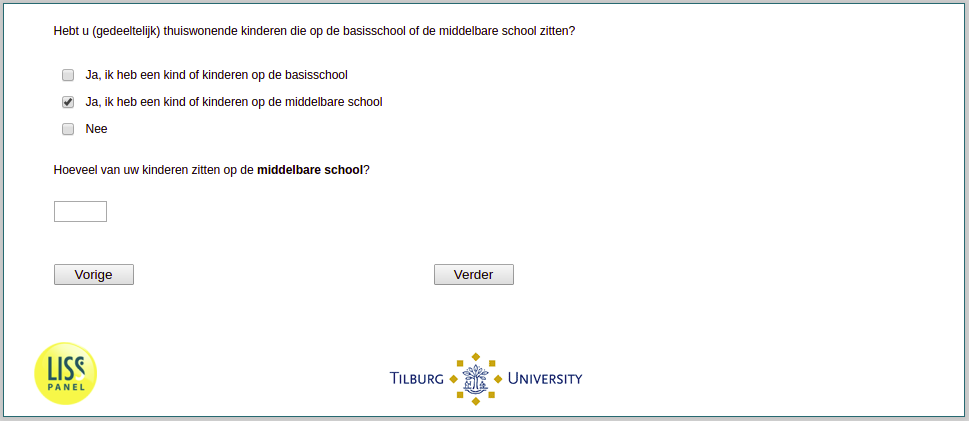

.. _w3d-v0b:

 
 .. role:: raw-html(raw) 
        :format: html 

`v0b` – Children in Secondary School
====================================

:raw-html:`←` :ref:`w3d-v0a` | :ref:`w3d-v1_bo` :raw-html:`→` 

*Routing to the question depends on answer in:* :ref:`w3d-v0`

Hoeveel van uw kinderen zitten op de middelbare school? 

:raw-html:`←` :ref:`w3d-v0a` | :ref:`w3d-v1_bo` :raw-html:`→` 

