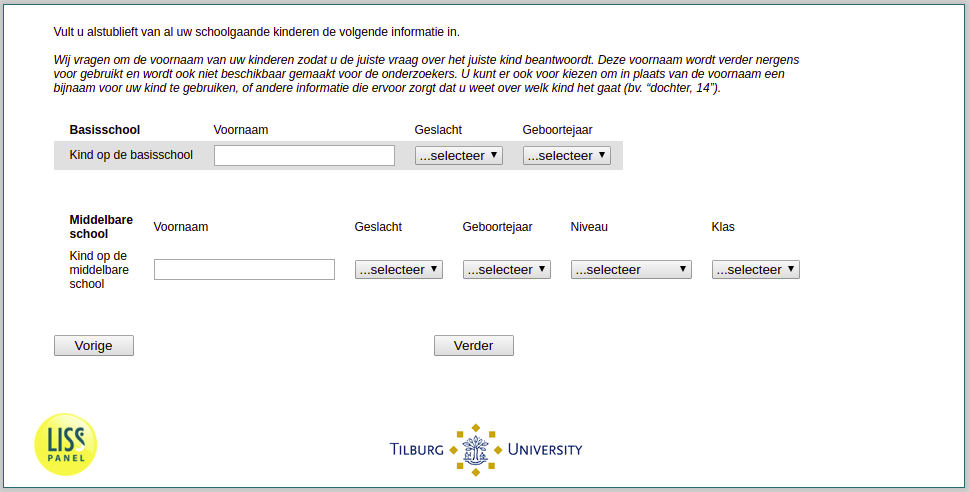

.. _w3d-v1_vo:

 
 .. role:: raw-html(raw) 
        :format: html 

`v1_vo` – Information Children Secondary 
=========================================

:raw-html:`&larr;` :ref:`w3d-v1_bo` | :ref:`w3d-v2_bokind` :raw-html:`&rarr;` 

*Routing to the question depends on answer in:* :ref:`w3d-nan`

Wij vragen om de voornaam van uw ^f_kindkinderen; zodat u de juiste vraag over het juiste kind beantwoordt. Deze voornaam wordt verder nergens voor gebruikt en wordt ook niet beschikbaar gemaakt voor de onderzoekers. U kunt er ook voor kiezen om in plaats van de voornaam een bijnaam voor uw kind te gebruiken, of andere informatie die ervoor zorgt dat u weet over welk kind het gaat (bv. “dochter, 14”).

.. csv-table::
   :delim: |

           Eerste kind op de middelbare school | :raw-html:`<form><input type="text" id="fname" name="fname"> </form>`
           Tweede kind op de middelbare school | :raw-html:`<form><input type="text" id="fname" name="fname"> </form>`
           Derde kind op de middelbare school | :raw-html:`<form><input type="text" id="fname" name="fname"> </form>`
           Vierde kind op de middelbare school | :raw-html:`<form><input type="text" id="fname" name="fname"> </form>`
           Vijfde kind op de middelbare school | :raw-html:`<form><input type="text" id="fname" name="fname"> </form>`

:raw-html:`&larr;` :ref:`w3d-v1_bo` | :ref:`w3d-v2_bokind` :raw-html:`&rarr;` 

