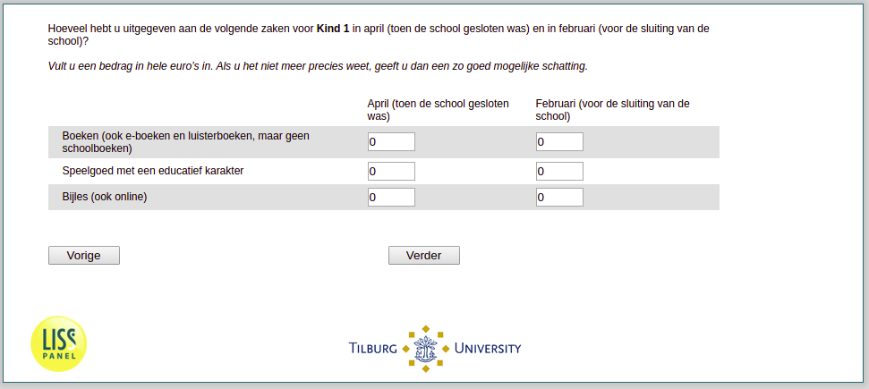

.. _w3d-v3_bokind: 

 
 .. role:: raw-html(raw) 
        :format: html 
 
`v3_bokind` – Spending on Children
============================================== 

:raw-html:`&larr;` :ref:`w3d-v2_bokind` | :ref:`w3d-v4_bokind` :raw-html:`&rarr;` 
 
*Routing to the question depends on answer in:* :ref:`w3d-v0` 

Hoeveel hebt u uitgegeven aan de volgende zaken voor de kind in april (toen de school gesloten was) en in februari (voor de sluiting van de school)? Vult u een bedrag in hele euro’s in. Als u het niet meer precies weet, geeft u dan een zo goed mogelijke schatting.
 
.. csv-table:: 
   :delim: | 
   :header: ,April, Februari
 
           Boeken (ook e-boeken en luisterboeken, maar geen schoolboeken) | :raw-html:`<form><input type="text" id="fname" name="fname"> </form>` |:raw-html:`<form><input type="text" id="fname" name="fname"> </form>` 
           Speelgoed met een educatief karakter | :raw-html:`<form><input type="text" id="fname" name="fname"> </form>` |:raw-html:`<form><input type="text" id="fname" name="fname"> </form>` 
           Bijles (ook online) | :raw-html:`<form><input type="text" id="fname" name="fname"> </form>` |:raw-html:`<form><input type="text" id="fname" name="fname"> </form>` 

:raw-html:`&larr;` :ref:`w3d-v2_bokind` | :ref:`w3d-v4_bokind` :raw-html:`&rarr;` 
 
