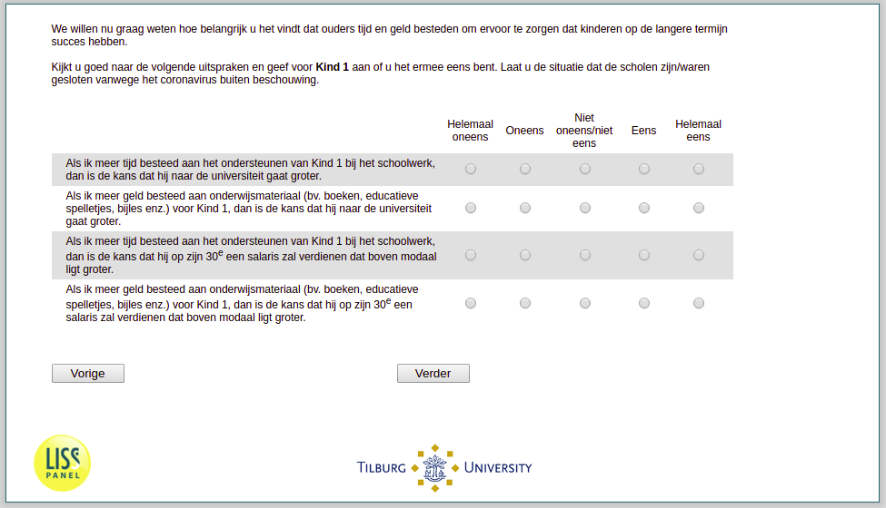

.. _w3d-v4_bokind: 

 
 .. role:: raw-html(raw) 
        :format: html 
 
`v4_bokind` – Investments in Children
================================================= 

:raw-html:`←` :ref:`w3d-v3_bokind` | :ref:`w3d-v5_bokind` :raw-html:`→` 
 
*Routing to the question depends on answer in:* :ref:`w3d-v0` 

We willen nu graag weten hoe belangrijk u het vindt dat ouders tijd en geld besteden om ervoor te zorgen dat kinderen op de langere termijn succes hebben.

Kijkt u goed naar de volgende uitspraken en geef aan of u het ermee eens bent. Laat u de situatie dat de scholen zijn/waren gesloten vanwege het coronavirus buiten beschouwing.
 
.. csv-table:: 
   :delim: | 
   :header: ,Helemaal oneens, Oneens,  Niet oneens/niet eens, Eens, Helemaal eens
 
           ls ik meer tijd besteed aan het ondersteunen van kind bij het schoolwerk, dan is de kans dat kind naar de universiteit gaat groter. | :raw-html:`❏`|:raw-html:`❏`|:raw-html:`❏`|:raw-html:`❏`|:raw-html:`❏` 
           Als ik meer geld besteed aan onderwijsmateriaal (bv. boeken, educatieve spelletjes, bijles enz.) voor kind, dan is de kans dat kind naar de universiteit gaat groter. | :raw-html:`❏`|:raw-html:`❏`|:raw-html:`❏`|:raw-html:`❏`|:raw-html:`❏` 
           Als ik meer tijd besteed aan het ondersteunen van kind bij het schoolwerk, dan is de kans dat hij op zijn 30e een salaris zal verdienen dat boven modaal ligt groter. | :raw-html:`❏`|:raw-html:`❏`|:raw-html:`❏`|:raw-html:`❏`|:raw-html:`❏` 
           Als ik meer geld besteed aan onderwijsmateriaal (bv. boeken, educatieve spelletjes, bijles enz.) voor kind, dan is de kans dat hij op zijn 30e een salaris zal verdienen dat boven modaal ligt groter. | :raw-html:`❏`|:raw-html:`❏`|:raw-html:`❏`|:raw-html:`❏`|:raw-html:`❏` 

:raw-html:`←` :ref:`w3d-v3_bokind` | :ref:`w3d-v5_bokind` :raw-html:`→` 
 
