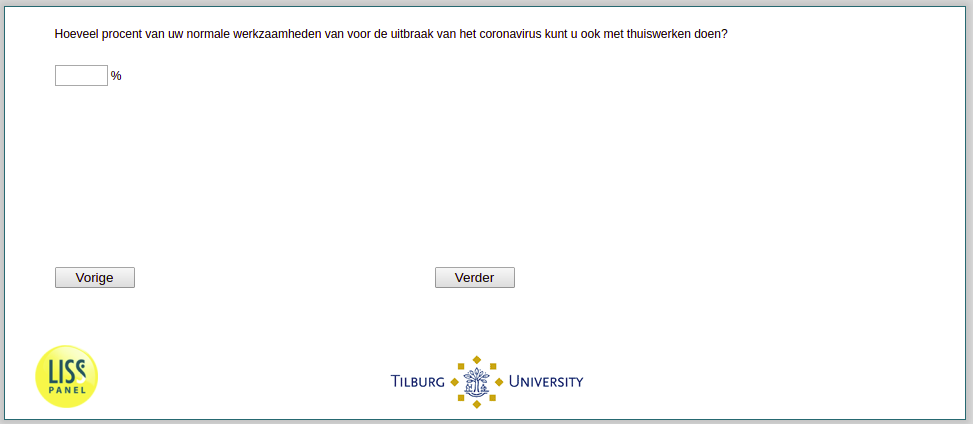

.. _w3d-work_perc: 

 
 .. role:: raw-html(raw) 
        :format: html 
 
`work_perc` – Working from Home Capacity
==================================================== 

:raw-html:`←` :ref:`w3d-vacsick` | :ref:`w3d-q16a` :raw-html:`→` 
 
*Routing to the question depends on answer in:* :ref:`w3d-EmploymentStatus` 

Hoeveel procent van uw normale werkzaamheden van voor de uitbraak van het coronavirus kunt u ook met thuiswerken doen? 
 

:raw-html:`←` :ref:`w3d-vacsick` | :ref:`w3d-q16a` :raw-html:`→` 
 
