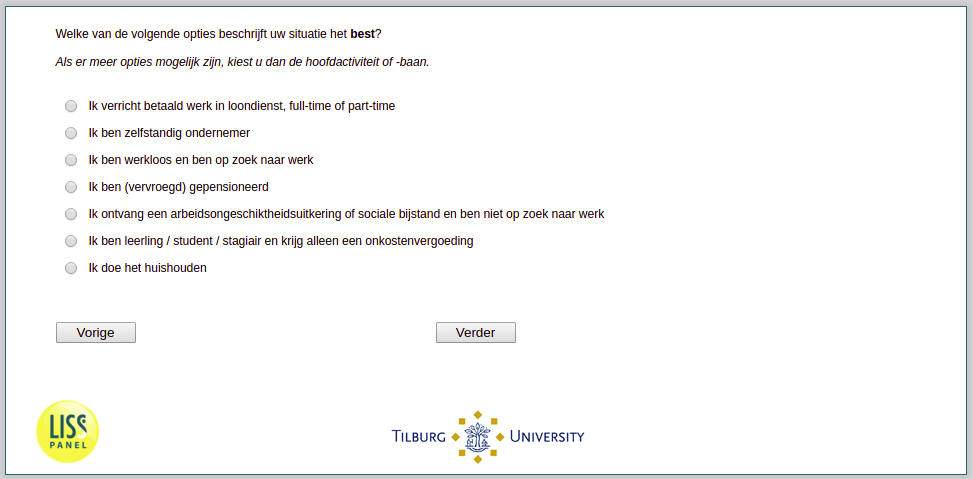

.. _w3e-EmploymentStatus:

 
 .. role:: raw-html(raw) 
        :format: html 

`EmploymentStatus` – Work Status
================================

:raw-html:`&larr;` :ref:`w3e-expectedduration` | :ref:`w3e-q14header` :raw-html:`&rarr;` 

Which of the following options best describes your situation? If multiple options apply, choose the main activity or job.

:raw-html:`&#10063;` – I am in paid employment, full-time or part-time

:raw-html:`&#10063;` – I am self-employed

:raw-html:`&#10063;` – I am unemployed and looking for work

:raw-html:`&#10063;` – I retired (early)

:raw-html:`&#10063;` – I receive disability benefit or social assistance and am not looking for work

:raw-html:`&#10063;` – I am an apprentice / student / trainee and only receive an expense allowance

:raw-html:`&#10063;` – I do the housework

:raw-html:`&larr;` :ref:`w3e-expectedduration` | :ref:`w3e-q14header` :raw-html:`&rarr;` 

