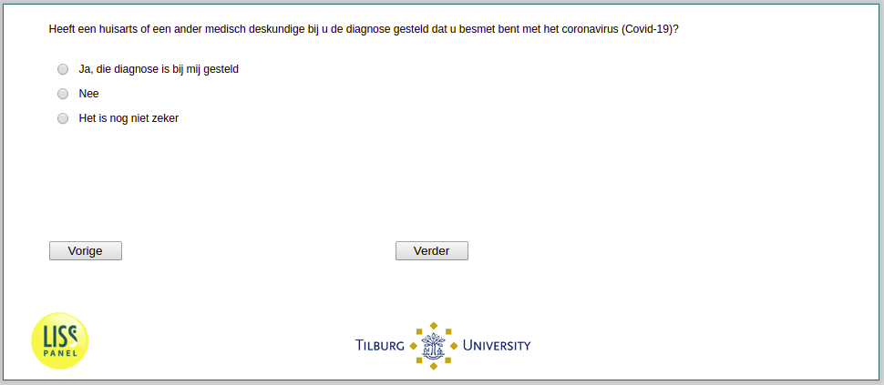

.. _w3e-InfectionDiagnosed:

 
 .. role:: raw-html(raw) 
        :format: html 

`InfectionDiagnosed` – InfectionDiagnosed
=========================================

:raw-html:`←` :ref:`w3e-intro` | :ref:`w3e-SelfPerceivedInfection` :raw-html:`→` 

Has a doctor or another healthcare professional diagnosed you with the coronavirus (COVID-19)?

.. csv-table::
   :delim: |
   :header: Yes I have been diagnosed with it, No, Unsure

           :raw-html:`❏`|:raw-html:`❏`|:raw-html:`❏`

:raw-html:`←` :ref:`w3e-intro` | :ref:`w3e-SelfPerceivedInfection` :raw-html:`→` 

