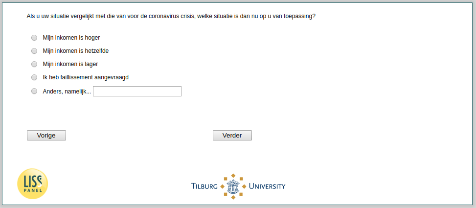

.. _w3e-change_selfempl:

 
 .. role:: raw-html(raw) 
        :format: html 

`change_selfempl` – Self-Employed Changes
=========================================

:raw-html:`&larr;` :ref:`w3e-change_empl` | :ref:`w3e-q2` :raw-html:`&rarr;` 

*Routing to the question depends on answer in:* :ref:`w3e-EmploymentStatus`

If you compare your situation to that before the coronavirus crisis, what situation applies to you now?

:raw-html:`&#10063;` – My income is higher

:raw-html:`&#10063;` – My income is the same

:raw-html:`&#10063;` – My income is lower

:raw-html:`&#10063;` – I filed for bankruptcy

:raw-html:`&#10063;` – Otherwise, namely...

:raw-html:`&larr;` :ref:`w3e-change_empl` | :ref:`w3e-q2` :raw-html:`&rarr;` 

