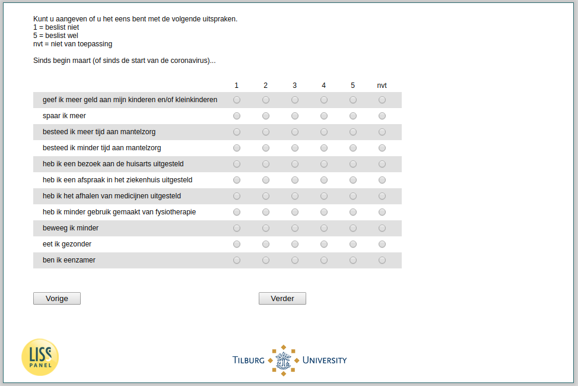

.. _w3e-es4_uitspraken: 

 
 .. role:: raw-html(raw) 
        :format: html 
 
`es4_uitspraken` – Activities since March
========================================================== 

:raw-html:`←` :ref:`w3e-korting` | :ref:`w3e-es4_doelen` :raw-html:`→` 
 

Please indicate if you agree with the following statements. 
1 = definitely not 
5 = definitely 
n/a = not applicable 
 
.. csv-table:: 
   :delim: | 
   :header: ,1 = definitely not, 2, 3, 4 , 5 = definitely, Nvt
 
           I give more money to my children and/or grandchildren | :raw-html:`❏`|:raw-html:`❏`|:raw-html:`❏`|:raw-html:`❏`|:raw-html:`❏`|:raw-html:`❏` 
           I save more | :raw-html:`❏`|:raw-html:`❏`|:raw-html:`❏`|:raw-html:`❏`|:raw-html:`❏`|:raw-html:`❏` 
           I spend more time on informal care | :raw-html:`❏`|:raw-html:`❏`|:raw-html:`❏`|:raw-html:`❏`|:raw-html:`❏`|:raw-html:`❏` 
           I spend less time on informal care | :raw-html:`❏`|:raw-html:`❏`|:raw-html:`❏`|:raw-html:`❏`|:raw-html:`❏`|:raw-html:`❏` 
           I have postponed a visit to the family doctor | :raw-html:`❏`|:raw-html:`❏`|:raw-html:`❏`|:raw-html:`❏`|:raw-html:`❏`|:raw-html:`❏` 
           I postponed an appointment at the hospital | :raw-html:`❏`|:raw-html:`❏`|:raw-html:`❏`|:raw-html:`❏`|:raw-html:`❏`|:raw-html:`❏` 
           I've postponed picking up medication | :raw-html:`❏`|:raw-html:`❏`|:raw-html:`❏`|:raw-html:`❏`|:raw-html:`❏`|:raw-html:`❏` 
           I have used less physiotherapy | :raw-html:`❏`|:raw-html:`❏`|:raw-html:`❏`|:raw-html:`❏`|:raw-html:`❏`|:raw-html:`❏` 
           I move less | :raw-html:`❏`|:raw-html:`❏`|:raw-html:`❏`|:raw-html:`❏`|:raw-html:`❏`|:raw-html:`❏` 
           I eat healthier | :raw-html:`❏`|:raw-html:`❏`|:raw-html:`❏`|:raw-html:`❏`|:raw-html:`❏`|:raw-html:`❏` 
           I'm lonelier | :raw-html:`❏`|:raw-html:`❏`|:raw-html:`❏`|:raw-html:`❏`|:raw-html:`❏`|:raw-html:`❏` 

:raw-html:`←` :ref:`w3e-korting` | :ref:`w3e-es4_doelen` :raw-html:`→` 
 
