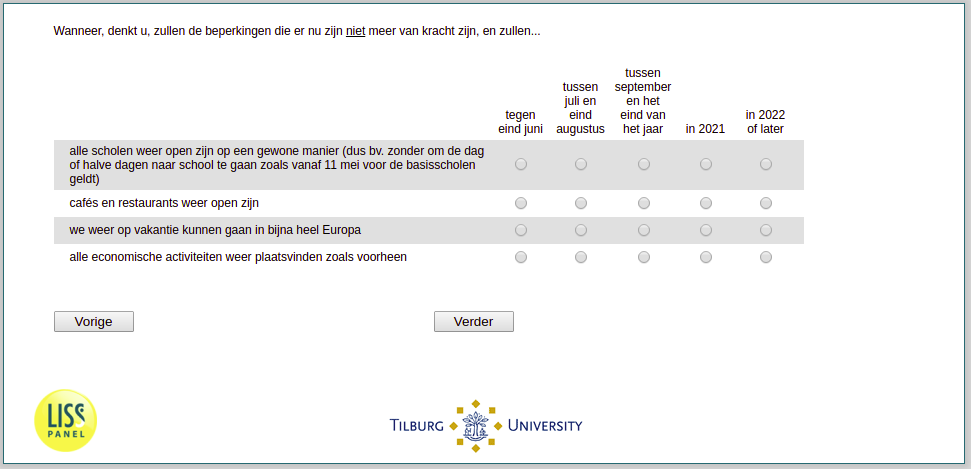

.. _w3e-expectedduration: 

 
 .. role:: raw-html(raw) 
        :format: html 
 
`expectedduration` – Expected Duration of Restrictions
========================================================================= 

:raw-html:`&larr;` :ref:`w3e-SAH` | :ref:`w3e-EmploymentStatus` :raw-html:`&rarr;` 
 

When do you think the restrictions that are now in place will no longer apply, and ...
 
.. csv-table:: 
   :delim: | 
   :header: ,by the end of June, between July and the end of August, between September and the end of the year, in 2021, in 2022 or later
 
           all schools are open again in a normal way (e.g. without going to school every other day or half-day as is the case for primary schools from 11 May). | :raw-html:`&#10063;`|:raw-html:`&#10063;`|:raw-html:`&#10063;`|:raw-html:`&#10063;`|:raw-html:`&#10063;` 
           cafes and restaurants are open again | :raw-html:`&#10063;`|:raw-html:`&#10063;`|:raw-html:`&#10063;`|:raw-html:`&#10063;`|:raw-html:`&#10063;` 
           we can go on holiday again in almost all of Europe | :raw-html:`&#10063;`|:raw-html:`&#10063;`|:raw-html:`&#10063;`|:raw-html:`&#10063;`|:raw-html:`&#10063;` 
           all economic activities take place as before | :raw-html:`&#10063;`|:raw-html:`&#10063;`|:raw-html:`&#10063;`|:raw-html:`&#10063;`|:raw-html:`&#10063;` 

:raw-html:`&larr;` :ref:`w3e-SAH` | :ref:`w3e-EmploymentStatus` :raw-html:`&rarr;` 
 
