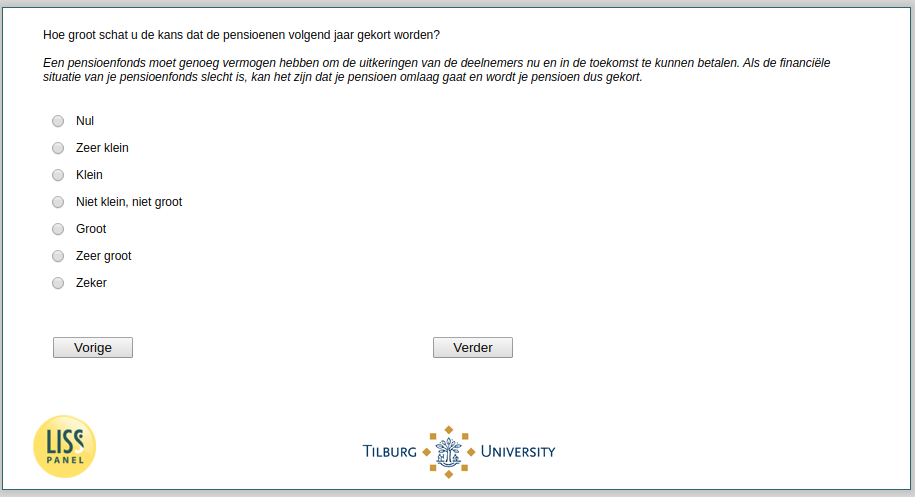

.. _w3e-pens_gekort: 

 
 .. role:: raw-html(raw) 
        :format: html 
 
`pens_gekort` – Expected Pension Cuts
=================================================== 

:raw-html:`←` :ref:`w3e-q27header_unempl` | :ref:`w3e-korting` :raw-html:`→` 
 
*Routing to the question depends on answer in:* :ref:`w3e-EmploymentStatus` 

How high do you estimate the chance that pensions will be cut next year? A pension fund must have enough assets to be able to pay the benefits of its members now and in the future. If the financial situation of your pension fund is bad, it is possible that your pension will be reduced. 
 
.. csv-table:: 
   :delim: | 
   :header: Zero, Very small, Small, Not small nor big,  Large, Very large, Certainly
 
           :raw-html:`❏`|:raw-html:`❏`|:raw-html:`❏`|:raw-html:`❏`|:raw-html:`❏`|:raw-html:`❏`|:raw-html:`❏` 

:raw-html:`←` :ref:`w3e-q27header_unempl` | :ref:`w3e-korting` :raw-html:`→` 
 
