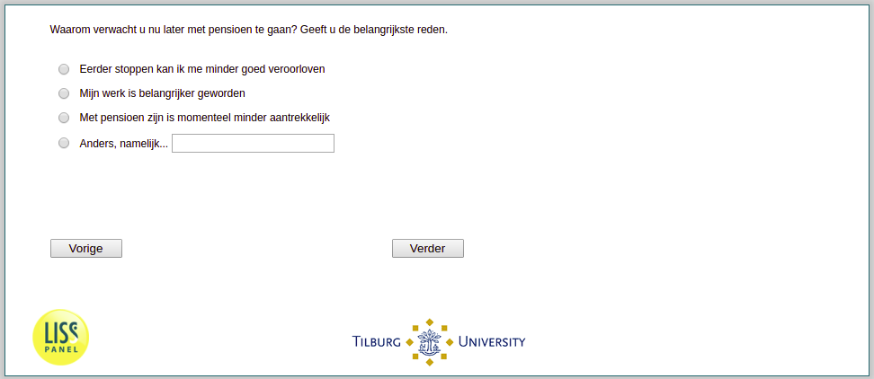

.. _w3e-pens_later: 

 
 .. role:: raw-html(raw) 
        :format: html 
 
`pens_later` – Reasons for Later Retirement
======================================================== 

:raw-html:`&larr;` :ref:`w3e-pens_eerder` | :ref:`w3e-q26` :raw-html:`&rarr;` 
 
*Routing to the question depends on answer in:* :ref:`w3e-EmploymentStatus` 

Why do you expect to retire later now? Give you the main reason.
 
:raw-html:`&#10063;` – I can't afford to quit sooner
 
:raw-html:`&#10063;` – My work has become more important
 
:raw-html:`&#10063;` – Retirement is currently less attractive
 
:raw-html:`&#10063;` – Otherwise, namely...
 

:raw-html:`&larr;` :ref:`w3e-pens_eerder` | :ref:`w3e-q26` :raw-html:`&rarr;` 
 
