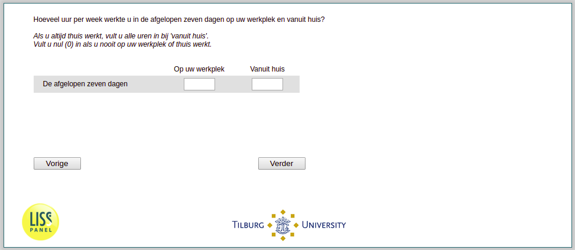

.. _w3e-q14: 

 
 .. role:: raw-html(raw) 
        :format: html 
 
`q14` – Working Hours Extended
==================================== 

:raw-html:`&larr;` :ref:`w3e-EmploymentStatus` | :ref:`w3e-vacsick` :raw-html:`&rarr;` 
 
*Routing to the question depends on answer in:* :ref:`w3e-EmploymentStatus` 

How many hours per week in the past seven days did you work at your workplace and from home? If you always work from home, fill in all hours at 'from home'. 
Fill in zero (0) if you never work at your workplace or at home.
 
.. csv-table:: 
   :delim: | 
 
           Past Seven Days - At Work | :raw-html:`<form><input type="text" id="fname" name="fname"> </form>` 
           Past Seven Days – At Home | :raw-html:`<form><input type="text" id="fname" name="fname"> </form>` 

:raw-html:`&larr;` :ref:`w3e-EmploymentStatus` | :ref:`w3e-vacsick` :raw-html:`&rarr;` 
 
