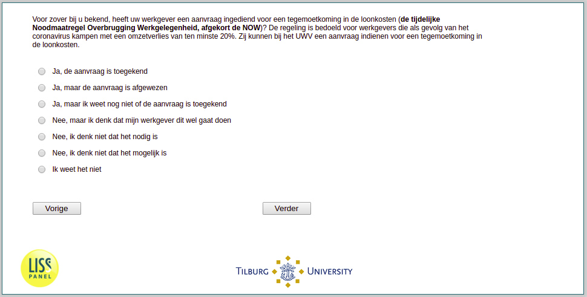

.. _w3e-q16a: 

 
 .. role:: raw-html(raw) 
        :format: html 
 
`q16a` – NOW
=================== 

:raw-html:`&larr;` :ref:`w3e-work_perc` | :ref:`w3e-q16b` :raw-html:`&rarr;` 
 
*Routing to the question depends on answer in:* :ref:`w3e-EmploymentStatus` 

To the best of your knowledge, has your employer submitted an application for an allowance for labour costs (the temporary Emergency Measure Bridging Employment, abbreviated to NOW)? The scheme is intended for employers who suffer a loss of turnover of at least 20% as a result of the coronavirus. They can apply to the UWV for an allowance for labour costs.
 
:raw-html:`&#10063;` – Yes, the application has been granted
 
:raw-html:`&#10063;` – Yes, but the application was rejected
 
:raw-html:`&#10063;` – Yeah, but I don't know if the application's been granted yet.
 
:raw-html:`&#10063;` – No, but I think my employer is going to do this
 
:raw-html:`&#10063;` – No, but I think my employer is going to do this
 
:raw-html:`&#10063;` – No, I don't think it's possible
 
:raw-html:`&#10063;` – I don't know.
 

:raw-html:`&larr;` :ref:`w3e-work_perc` | :ref:`w3e-q16b` :raw-html:`&rarr;` 
 
