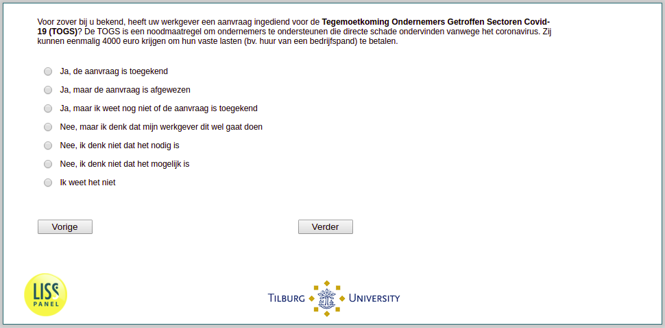

.. _w3e-q16b: 

 
 .. role:: raw-html(raw) 
        :format: html 
 
`q16b` – TOGS
==================== 

:raw-html:`&larr;` :ref:`w3e-q16a` | :ref:`w3e-q16c` :raw-html:`&rarr;` 
 
*Routing to the question depends on answer in:* :ref:`w3e-EmploymentStatus` 

To the best of your knowledge, has your employer submitted an application for the Covid-19 Entrepreneurs Affected Sectors Tegemoetkoming (TOGS)? The TOGS is an emergency measure to support entrepreneurs who are directly affected by the coronavirus. They can receive a one-off sum of 4000 euros to pay their fixed costs (e.g. rent of a business premises).
 
:raw-html:`&#10063;` – Yes, the application has been granted
 
:raw-html:`&#10063;` – Yes, but the application was rejected
 
:raw-html:`&#10063;` – Yeah, but I don't know if the application's been granted yet.
 
:raw-html:`&#10063;` – No, but I think my employer is going to do this
 
:raw-html:`&#10063;` – No, I don't think it's necessary
 
:raw-html:`&#10063;` – No, I don't think it's possible
 
:raw-html:`&#10063;` – I don't know.
 

:raw-html:`&larr;` :ref:`w3e-q16a` | :ref:`w3e-q16c` :raw-html:`&rarr;` 
 
