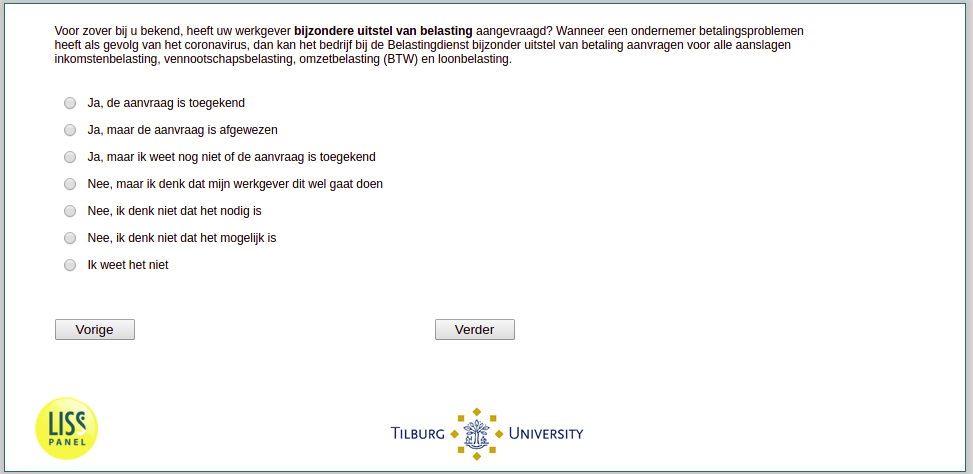

.. _w3e-q16c:

 
 .. role:: raw-html(raw) 
        :format: html 

`q16c` – Tax Deferral
=====================

:raw-html:`&larr;` :ref:`w3e-q16b` | :ref:`w3e-q17a` :raw-html:`&rarr;` 

*Routing to the question depends on answer in:* :ref:`w3e-EmploymentStatus`

To the best of your knowledge, has your employer applied for a special tax deferral? If an entrepreneur has payment problems as a result of the corona virus, the company can apply to the tax authorities for a special deferment of payment for all income tax, corporation tax, turnover tax (VAT) and wage tax assessments.

:raw-html:`&#10063;` – Yes, the application has been granted

:raw-html:`&#10063;` – Yes, but the application was rejected

:raw-html:`&#10063;` – Yeah, but I don't know if the application's been granted yet.

:raw-html:`&#10063;` – No, but I think my employer is going to do this

:raw-html:`&#10063;` – No, I don't think it's necessary

:raw-html:`&#10063;` – No, I don't think it's possible

:raw-html:`&#10063;` – No, I don't think it's possible

:raw-html:`&larr;` :ref:`w3e-q16b` | :ref:`w3e-q17a` :raw-html:`&rarr;` 

