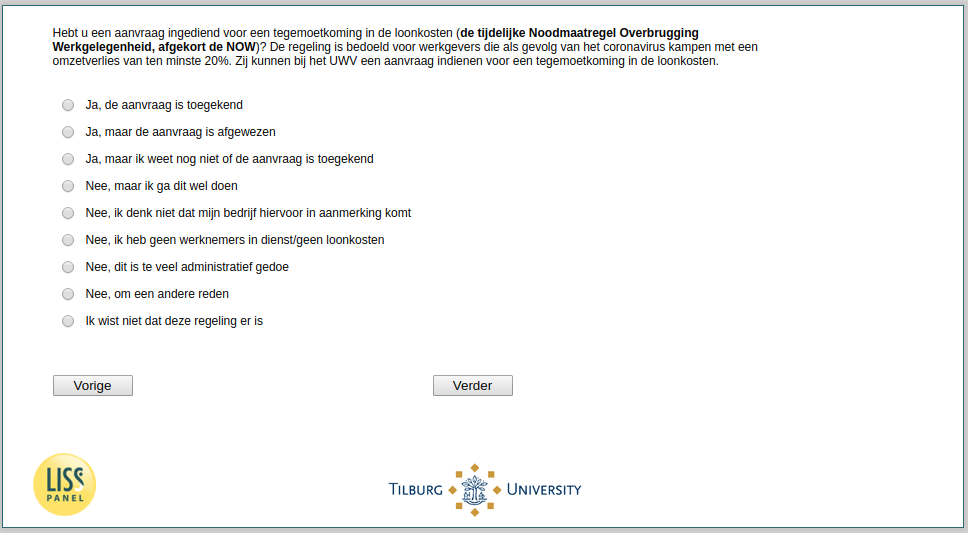

.. _w3e-q17a:

 
 .. role:: raw-html(raw) 
        :format: html 

`q17a` – NOW among Self-Employed
================================

:raw-html:`&larr;` :ref:`w3e-q16c` | :ref:`w3e-q17b` :raw-html:`&rarr;` 

*Routing to the question depends on answer in:* :ref:`w3e-EmploymentStatus`

Have you submitted an application for an allowance for labour costs (the temporary Emergency Measure Bridging Employment, abbreviated to NOW)? The scheme is intended for employers who suffer a loss of turnover of at least 20% as a result of the coronavirus. They can apply to the UWV for an allowance for labour costs.

:raw-html:`&#10063;` – Yes, the application has been granted

:raw-html:`&#10063;` – Yes, but the application was rejected

:raw-html:`&#10063;` – Yeah, but I don't know if the application's been granted yet.

:raw-html:`&#10063;` – No, but I'm gonna do this

:raw-html:`&#10063;` – No, I don't think my company qualifies for this

:raw-html:`&#10063;` – No, I have no employees/no payroll costs

:raw-html:`&#10063;` – No, this is too much red tape

:raw-html:`&#10063;` – No, for another reason

:raw-html:`&#10063;` – I didn't know there was this arrangement

:raw-html:`&larr;` :ref:`w3e-q16c` | :ref:`w3e-q17b` :raw-html:`&rarr;` 

