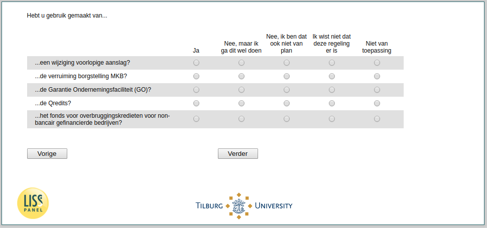

.. _w3e-q17f_header:

 
 .. role:: raw-html(raw) 
        :format: html 

`q17f_header` – Other support Self-Employed
===========================================

:raw-html:`&larr;` :ref:`w3e-q17e` | :ref:`w3e-change_empl` :raw-html:`&rarr;` 

*Routing to the question depends on answer in:* :ref:`w3e-EmploymentStatus`

Have you used…

.. csv-table::
   :delim: |
   :header: ,Yes, No but I'm gonna do this, No I don't intend to, I didn't know there was this arrangement, Not applicable

           ...an amendment provisional assessment? | :raw-html:`&#10063;`|:raw-html:`&#10063;`|:raw-html:`&#10063;`|:raw-html:`&#10063;`|:raw-html:`&#10063;`
           ...the extension of the guarantee for SMEs? | :raw-html:`&#10063;`|:raw-html:`&#10063;`|:raw-html:`&#10063;`|:raw-html:`&#10063;`|:raw-html:`&#10063;`
           ...the Enterprise Guarantee Facility (GO)? | :raw-html:`&#10063;`|:raw-html:`&#10063;`|:raw-html:`&#10063;`|:raw-html:`&#10063;`|:raw-html:`&#10063;`
           ...the Qredits? | :raw-html:`&#10063;`|:raw-html:`&#10063;`|:raw-html:`&#10063;`|:raw-html:`&#10063;`|:raw-html:`&#10063;`
           ...the bridging loan fund for non-bank businesses? | :raw-html:`&#10063;`|:raw-html:`&#10063;`|:raw-html:`&#10063;`|:raw-html:`&#10063;`|:raw-html:`&#10063;`

:raw-html:`&larr;` :ref:`w3e-q17e` | :ref:`w3e-change_empl` :raw-html:`&rarr;` 

