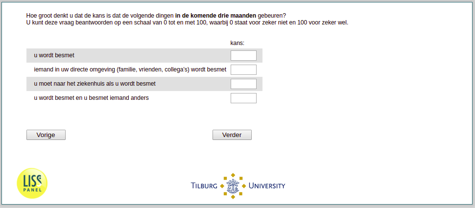

.. _w3e-q1header: 

 
 .. role:: raw-html(raw) 
        :format: html 
 
`q1header` – Subjective Risks
======================================== 

:raw-html:`&larr;` :ref:`w3e-SelfPerceivedInfection` | :ref:`w3e-q30` :raw-html:`&rarr;` 
 

On a scale of 0 to 100 percent, how likely do you think that the following events will happen in the the next three months?
 
.. csv-table:: 
   :delim: | 
 
           You will be infected | :raw-html:`<form><input type="text" id="fname" name="fname"> </form>` 
           Someone in your direct environment (family, friends, colleagues) will be infected | :raw-html:`<form><input type="text" id="fname" name="fname"> </form>` 
           You will have to go to the hospital if you get infected    | :raw-html:`<form><input type="text" id="fname" name="fname"> </form>` 
           You will be infected and you infect someone else | :raw-html:`<form><input type="text" id="fname" name="fname"> </form>` 

:raw-html:`&larr;` :ref:`w3e-SelfPerceivedInfection` | :ref:`w3e-q30` :raw-html:`&rarr;` 
 
